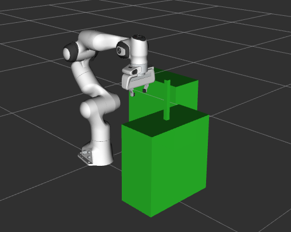
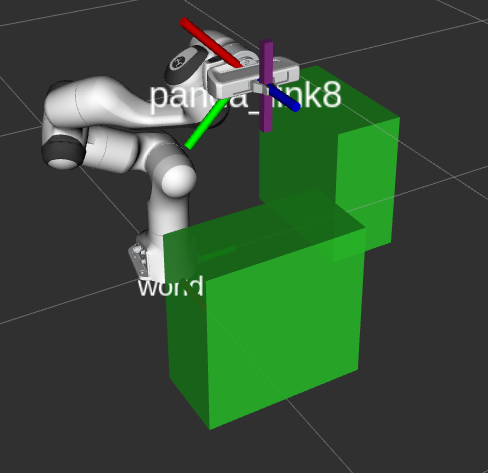
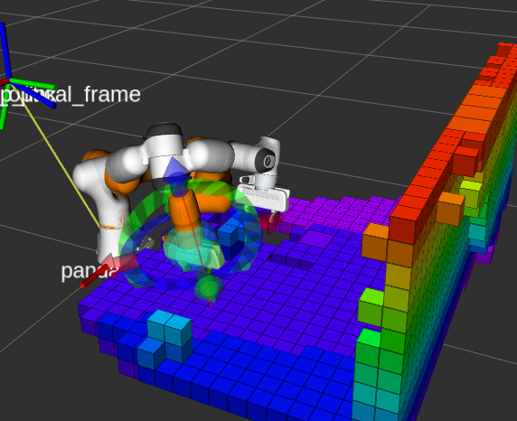
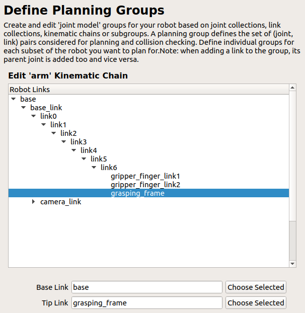
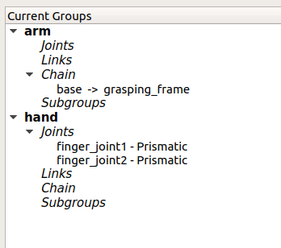
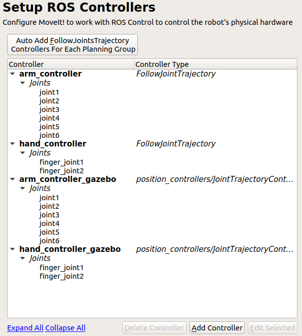
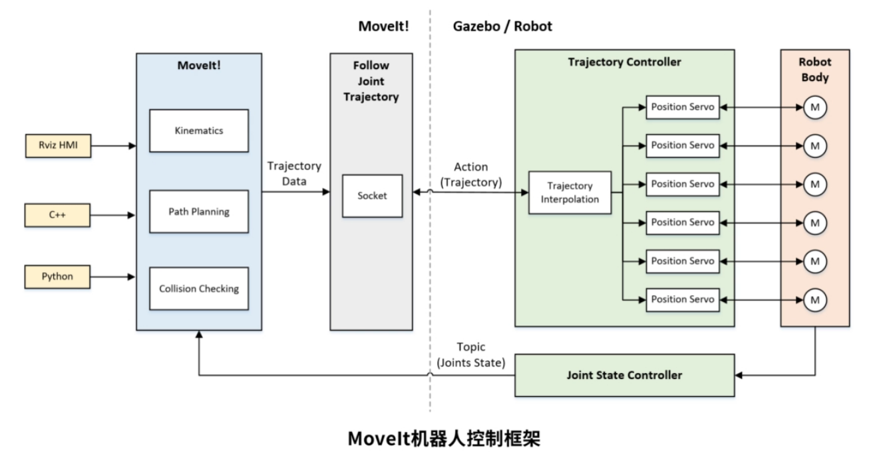
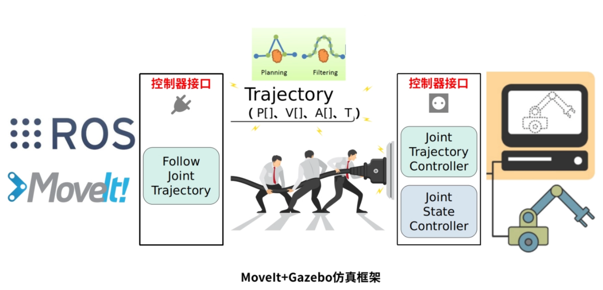

ROS Learning

## ROS简介

 ROS系统是起源于2007年斯坦福大学人工智能实验室的项目与机器人技术公司Willow Garage的个人机器人项目（Personal Robots Program）之间的合作，2008年之后就由Willow Garage来进行推动。

 ROS的首要设计目标是在机器人研发领域提高代码复用率。ROS是一种分布式处理框架（又名Nodes）。

**（1）点对点设计**

 **（2）多语言支持**

（3）精简与集成

（4）工具包丰富

（5）免费且开源

### ROS框架

一种是核心（main），一种是库（universe）

节点、消息、主题、服务

包、堆

rviz、tf、gazebo

rviz具备很强的扩展性，可以用来制作成机器人控制的上位机

移动机器人的案例：

turtlebot：

ROS探索总结：四到八;三十；

https://www.guyuehome.com/237

https://www.guyuehome.com/243

https://www.guyuehome.com/248

胡春旭研究生时的作品：

https://www.guyuehome.com/1856

机械臂：

https://www.guyuehome.com/455


>  最后，来发表一些对ROS的看法。ROS虽然好用，但是目前的ROS1还只适合于研发，如果没有强大的研发能力，建议还是不要轻易应用于产品。我们在开发过程中，遇到过以下一些坑：
>
> 1. roscore会突然挂掉，node会突然挂掉，rviz会突然挂掉，ROS的一切都会挂，系统就go die。。。 
>
> 2. moveit没办法实现连续运动，也没有点动等基本操作，需要去看moveit的底层代码然后重新组合去实现。 
>
> 3. ROS没有实时功能，需要自己搭建实时核，开发实时任务 
>
> 4. ROS资源占用率较大，对计算机的性能要求较高 


ROS的一些缺陷：

缺乏构建多机器人系统的标准方法；

在Windows、MacOS、RTOS等系统上无法应用或者功能有限；

缺少实时性方面的设计；

需要良好的网络环境保证数据的完整性，而且网络没有数据加密、安全防护等功能；

ROS 1的稳定性欠佳，研究开发与上市产品之间的过渡艰难；

## ROS通讯机制介绍

roscore：启动ROS系统核心的指令。启动master节点，用于给其他节点提供命名和注册的服务，能够记录节点所发布的话题或者服务申请，建立节点之间通讯的桥梁。master还包含参数服务器，节点能够通过该服务器实时存储以及获取一些系统参数，便于节点的配置。此外还会启动rosout节点，该节点能够订阅、记录、再发布messages，并且能够提供一个可视化的后台控制台。

Node：node是ROS中的进程单元，是系统的最小组成单元，node有良好的容错性，相互之间是独立的，说明即使某个节点崩溃，并不会影响到其他的节点。每个节点都会有一个全局的用于辨识的名称。

Service：服务在ROS中是一种请求-应答式的通讯模型，能够实现节点之间点对点的通讯，并能够得到反馈的消息。

Topics：话题是ros节点之间命名的消息传输通道，能够实时的从发布者（publisher）传递消息（message）到订阅者（subscriber），是一种无方向的数据流式（unidirectional，streaming）通讯模型。

rosbag：一种记录topic的工具，将数据按时间标签存储为.bag文件，并支持数据的回放，便于实验数据分析。

yaml：一种配置文件，按照树的结构存储数据，用于轨迹文件的保存以及舵机的配置。


### 话题模型


### 服务模型


### action模型


### rosbag

例程：将存储好的rosbag进行发布

```c++
#include "ros/ros.h"
#include <ros/package.h>
#include <rosbag/bag.h>
#include <rosbag/view.h>
#include <sensor_msgs/PointCloud2.h>

int main(int argc, char** argv)
{
  ros::init(argc, argv, "bag_publisher_maintain_time");
  ros::NodeHandle nh;

  ros::Publisher point_cloud_publisher = nh.advertise<sensor_msgs::PointCloud2>("/camera/depth_registered/points", 1);
  ros::Rate loop_rate(0.1);

  // Variable holding the rosbag containing point cloud data.
  rosbag::Bag bagfile;
  std::string path = ros::package::getPath("robot_control");
  path += "/bags/perception_tutorial.bag";
  bagfile.open(path, rosbag::bagmode::Read);

  std::vector<std::string> topics;
  topics.push_back("/camera/depth_registered/points");

  // Iterator for topics in bag.
  rosbag::View bagtopics_iter(bagfile, rosbag::TopicQuery(topics));

  for (auto const msg : bagtopics_iter)
  {
    sensor_msgs::PointCloud2::Ptr point_cloud_ptr = msg.instantiate<sensor_msgs::PointCloud2>();
    if (point_cloud_ptr == NULL)
    {
      std::cout << "error" << std::endl;
      break;
    }

    while (ros::ok())
    {
      point_cloud_ptr->header.stamp = ros::Time::now();
      point_cloud_publisher.publish(*point_cloud_ptr);
      ros::spinOnce();
      loop_rate.sleep();
    }
  }
  bagfile.close();
  return 0;
}
```


## ROS 文件讲解

### package.xml

package.xml
包含包的一些基本信息，例如

```xml
<name>:包的名字
<url type="website">http://wiki.ros.org/my_ros_learning</url>:外链，可以是提供教程等
定义包的依赖，依赖可以是包或者系统的依赖：
<depend>roscpp</depend>：单单的depend tag等价于 build_depend 以及 exec_depend
<build_depend>roscpp</build_depend> 编译时的依赖
<exec_depend>roscpp</exec_depend> 执行依赖
<build_export_depend>message_generation</build_export_depend>:编译导出时的依赖
<buildtool_depend>catkin</buildtool_depend>：编译工具
<exec_depend>message_runtime</exec_depend>：执行依赖
<build_depend>message_generation</build_depend>：编译依赖
<test_depend>gtest</test_depend>：执行依赖
<doc_depend>doxygen</doc_depend>：当仅需要编译文档时使用
当你需要使用其他工具的时候在
<export>....</export>中实现
CMakeList.txt
cmake_minimum_required(VERSION 2.8.3)：cmake版本要求
project(my_ros_learning)：工程名称
当采用c++11编译的时候
add_compile_options(-std=c++11)
```

### launch文件

Ex：

```xml
<launch>
    <arg name="usb_port"    default="/dev/ttyUSB0"/>
    <arg name="dxl_baud_rate"   default="57600"/>    
    <param name="dynamixel_info"    value="$(find my_dynamixel_workbench_test)/cfg/joint_1_0.yaml"/>
    <param name="trajectory_info" value="$(find my_dynamixel_workbench_test)/cfg/trajectory_01.yaml"/>
    <param name="outputFilePath" value="$(find my_dynamixel_workbench_test)/state_data/data2.txt"/>
    <node name="my_dxl_master" pkg="my_dynamixel_workbench_test" type="my_dxl_master" 
            output="screen"    args="$(arg usb_port) $(arg dxl_baud_rate)" >
        <rosparam>
        dxl_read_period: 0.010f
        dxl_write_period: 0.010f
        publish_period: 0.10f
        </rosparam>
    </node>
</launch>
```

arg:

param:

rosparam:

node:


## urdf 模型导入

solidworks转urdf


urdf文件解读

```xml
<?xml version="1.0"?>
<robot name="">
    <material name="">
    	<color rgba="1 1 1 0.95"/>
    </material>
    <link name="">
        <visual>
            <origin xyz="0 0 0.02" rpy="0 0 0"/>
            <geometry>
  				<mesh filename="package://mbot_description/meshes/kinect.dae" />
                # <box size="0.07 0.3 0.09" />
            </geometry>
            <material name="" />
        </visual>
        <inertia>
            <mass value="500" />
            <inertia ixx="1.0" ixy="0.0" ixz="0.0" iyy="0.5" iyz="0.0" izz="1.0" />
        </inertia>
        <collision>
            <origin rpy="0 1.5707963 0" xyz="-0.05 0 0" />
            <geometry>
                <cylinder length="0.1" radius="0.03" />
            </geometry>
        </collision>
    </link>
    <joint name="" type="">
    	<parent link=""/>
        <child link=""/>
        <origin xyz="" rpy=""/>
        <axis xyz=""/>
        <limit effort="300" lower="-3.14" upper="3.14" velocity="1"/>
    </joint>
</robot>
```


urdf文件检查


## tf


## moveit官方学习

### 官方示例

首先安装官方教程源码

```shell
git clone https://github.com/ros-planning/moveit_tutorials.git -b melodic-devel
git clone https://github.com/ros-planning/panda_moveit_config.git -b melodic-devel
```


### 底层控制器（Low Level Controllers）

> We will assume that your robot offers a `FollowJointTrajectory` action service for the arms on your robot and (optionally) a `GripperCommand` service for your gripper.

* YAML Configuration

文件名形如：`controllers.yaml`

* Create the Controller launch file

新建 controller launch file（`robot_moveit_controller_manager.launch.xml`）

内容如下

```xml
<launch>
 <!-- Set the param that trajectory_execution_manager needs to find the controller plugin -->
 <arg name="moveit_controller_manager" default="moveit_simple_controller_manager/MoveItSimpleControllerManager" />
 <param name="moveit_controller_manager" value="$(arg moveit_controller_manager)"/>
 <!-- load controller_list -->
 <rosparam file="$(find robot_moveit_config)/config/controllers.yaml"/>
</launch>
```

* Debugging Information

使用`rostopic list`或者`rostopic info topic_name`，如果看到下列的话题说明正确

> - /panda_arm_controller/follow_joint_trajectory/goal
> - /panda_arm_controller/follow_joint_trajectory/feedback
> - /panda_arm_controller/follow_joint_trajectory/result
> - /hand_controller/gripper_action/goal
> - /hand_controller/gripper_action/feedback
> - /hand_controller/gripper_action/result

* Remapping /joint_states topic

如果你在运行`move group node`，你可能需要重新映射（remap）`/joint_states` 到`/robot/joint_states`，否则Moveit无法获取关节的feedback，重新映射的方式如下

```xml
<node pkg="moveit_ros_move_group" type="move_group" name="any_name" output="screen">
  <remap from="joint_states" to="robot/joint_states"/>
</node>
```

或者你可以编写一个订阅正确话题名称的订阅者（subscriber），通过订阅者的反馈来保证你的运动规划组的机器人的初始状态对应正确的关节角。

* Trajectory Execution Manager Options

配置执行管道（execution pipeline）的表现和安全性，在`trajectory_execution.launch.xml`文件中定义

参数包括：

`execution_duration_monitoring`：如果为false，则不会抛出错误，因为轨迹花费的时间比预期在底层控制器侧完成的时间长

`allowed_goal_duration_margin`：在触发轨迹取消之前，允许超出预期的执行时间（在缩放后应用）

`allowed_start_tolerance`：允许关节值公差用于验证轨迹的第一点与当前机器人状态匹配。 如果设置为零，将跳过等待机器人在执行后停止的过程

### ros_control

> http://wiki.ros.org/ros_control


ros_control包输入为：来自机器人执行器编码器（encoders）的关节状态数据（joint state data）和输入设定点作为输入。 它使用通用的控制回路反馈机制（通常是PID控制器）来控制发送到执行器的输出（比如力矩、电流、电压）。 ros_control对于没有joint position，effort（关节位置、力）等一一对应关系的物理机制的情况时，会变得更加复杂，但是这些情况是使用转换（transmission）来解决的。

**控制器：controllers**

你可以自己创建自己的控制器，提供的控制器如下（所有都采用的前馈控制器）

* 力控制器，指定期望的关节力或力矩
  * joint_effort_controller 
  * joint_position_controller
  * joint_velocity_controller
* 关节状态控制器，将硬件接口`hardware_interface::[JointStateInterface] `所有注册的信息封装成`[sensor_msgs/JointState]`：joint_state_controller
* 位置控制器：设置多关节的位置，joint_position_controller，joint_group_position_controller 
* 速度控制器：设置多关节的速度，joint_velocity_controller ，joint_group_velocity_controller 
* 关节轨迹控制器： Extra functionality for splining an entire trajectory. 
  * position_controller 
  * velocity_controller 
  * effort_controller 
  * position_velocity_controller 
  * position_velocity_acceleration_controller 

**硬件接口：**

待阅读：

http://gazebosim.org/tutorials?tut=ros_control&cat=connect_ros

http://gazebosim.org/tutorials?cat=connect_ros

http://wiki.ros.org/gazebo_ros_pkgs

https://answers.ros.org/question/320990/moveit-unable-to-identify-any-set-of-controllers/

https://answers.ros.org/question/296694/follow_joint_trajectory-action-client-not-connected/

http://docs.ros.org/melodic/api/moveit_tutorials/html/doc/moveit_commander_scripting/moveit_commander_scripting_tutorial.html

https://zhuanlan.zhihu.com/p/63229276


### moveit编程

> 参考古月居ros编程教程
>
> 官方教程：http://docs.ros.org/melodic/api/moveit_tutorials/html/index.html

在moveit中，提供了最简单的用户接口`MoveGroupInterface`类，它能够提供满足开发人员大多数操作的函数，例如设定关节或者位姿目标，产生运动计划（motion plan），使机器人运动，向环境中添加物体，将物体附着到机器人上等等。该接口通过ROS中的话题、服务、行为模型与`MoveGroup Node`进行通讯。

我们通过`MoveGroupInterface`类来表示你需要控制或规划的规划组

通过`PlanningSceneInterface`来向虚拟的世界添加或移除具备碰撞属性的物体

在按照官方给定教程学习时，需要安装

`sudo apt-get install ros-melodic-moveit-visual-tools`


假设我们已经准备好机器人的模型以及完成moveit的配置

编程的流程：

1. 连接控制需要的规划组
2. 设置目标位姿（关节空间或笛卡尔空间）
3. 设置运动约束（可选）
4. 使用Moveit！规划一条到达目标的轨迹
5. 修改轨迹（如速度等参数）
6. 执行规划出的轨迹

首先建立一个新的包

```shell
catkin_create_pkg robot_control rospy roscpp moveit_msgs moveit_ros_perception moveit_ros_planning_interface trajectory_msgs
```

其中CMakeLists.txt的关键部分如下

```cmake
add_compile_options(-std=c++11)

find_package(catkin REQUIRED COMPONENTS
  roscpp
  rospy
  moveit_msgs
  moveit_ros_perception
  moveit_ros_planning_interface
  trajectory_msgs
)

catkin_package(
#  INCLUDE_DIRS include
#  LIBRARIES probot_demo
   CATKIN_DEPENDS roscpp rospy moveit_core moveit_ros_planning_interface
#  DEPENDS system_lib
)

include_directories(
# include
  ${catkin_INCLUDE_DIRS}
)
```


#### 关节空间运动

这里示例C800机器人的控制方法，采用C++

首先包含头文件：

```c++
#include <ros/ros.h>
#include <moveit/move_group_interface/move_group_interface.h>
```

##### **正运动学控制的方法**

流程：先确定**group** 再确定**约束** 再确定**目标位置** 再**规划**，最后**执行**

c++代码如下：

```c++
#include <ros/ros.h>
#include <moveit/move_group_interface/move_group_interface.h>

int main(int argc,char **argv)
{
    ros::init(argc,argv,"c800_moveit_fk");
    ros::AsyncSpinner spinner(1);
    spinner.start();

    // 这里指定规划组 别名（预先设置好的规划组名字）
    moveit::planning_interface::MoveGroupInterface arm("arm");

    //设置机械臂运动的允许误差值
    arm.setGoalJointTolerance(0.001);

    //设置允许的最大速度和加速度，0.2表示20%
    arm.setMaxAccelerationScalingFactor(0.5);
    arm.setMaxVelocityScalingFactor(0.5);

    //控制机械臂先回到初始的位置
    arm.setNamedTarget("home");
    arm.move();
    sleep(1);

    double targetPose[6] = {0.391410, -0.676384, -0.376217, 0.0, 1.052834, 0.454125};
    std::vector<double> joint_group_positions(6);
    joint_group_positions[0] = targetPose[0];
    joint_group_positions[1] = targetPose[1];
    joint_group_positions[2] = targetPose[2];
    joint_group_positions[3] = targetPose[3];
    joint_group_positions[4] = targetPose[4];
    joint_group_positions[5] = targetPose[5];

    arm.setJointValueTarget(joint_group_positions);
    arm.move();
    sleep(1); 

    // 控制机械臂先回到初始化位置
    arm.setNamedTarget("home");
    arm.move();
    sleep(1);

    ros::shutdown(); 

    return 0;   
}
```

mark 1：

`ros::Asyncspinner`

对于一些只订阅一个话题的简单节点来说，我们使用`ros::spin()`进入接收循环，每当有订阅的话题发布时，进入回调函数接收和处理消息数据。但是更多的时候，一个节点往往要接收和处理不同来源的数据，并且这些数据的产生频率也各不相同，当我们在一个回调函数里耗费太多时间时，会导致其他**回调函数被阻塞**，导致数据丢失。这种场合需要给一个节点开辟多个线程，保证数据流的畅通。 
`ros::Asyncspinner`有`start()`和`stop()`函数，在销毁时会自动停止。

`ros::AsyncSpinner spinner(4)`表示使用4个线程


##### 逆运动学控制的方法	

首先选择规划组，获取末端执行器，设置运动约束，选择相对参考坐标系，通过四元数描述末端的目标姿态，通过**逆向运动学**求解，再执行。

```c++
#include <string>
#include <ros/ros.h>
#include <moveit/move_group_interface/move_group_interface.h>

int main(int argc,char **argv)
{
    ros::init(argc,argv,"c800_moveit_ik");
    ros::AsyncSpinner spinner(1);
    spinner.start();

    moveit::planning_interface::MoveGroupInterface arm("arm");

    // 获取终端link的名称
    std::string end_effector_link = arm.getEndEffectorLink();

    //设置目标位置所使用的参考坐标系
    std::string reference_frame = "base_link";
    arm.setPoseReferenceFrame(reference_frame);

    //设置位置(单位：米)和姿态（单位：弧度）的允许误差
    arm.setGoalPositionTolerance(0.001);
    arm.setGoalOrientationTolerance(0.01);

    //设置允许的最大速度和加速度
    arm.setMaxAccelerationScalingFactor(0.2);
    arm.setMaxVelocityScalingFactor(0.2);

    // 控制机械臂先回到初始化位置
    arm.setNamedTarget("home");
    arm.move();
    sleep(1);

    //设置机器人终端的目标位置  orientation 描述姿态 position 描述位置
    geometry_msgs::Pose target_pose;
    target_pose.orientation.x = 0.70692;
    target_pose.orientation.y = 0.0;
    target_pose.orientation.z = 0.0;
    target_pose.orientation.w = 0.70729;

    target_pose.position.x = 0.2593;
    target_pose.position.y = 0.0636;
    target_pose.position.z = 0.1787;

    //设置机械臂当前的状态为运动初始状态
    arm.setStartStateToCurrentState();

    arm.setPoseTarget(target_pose);

    // 进行运动规划，计算机器人移动到目标的运动轨迹，此时只是计算出轨迹，并不会控制机械臂运动
    moveit::planning_interface::MoveGroupInterface::Plan plan;
    moveit::planning_interface::MoveItErrorCode success = arm.plan(plan);

    ROS_INFO("Plan (pose goal) %s",success?"":"FAILED");

    //让机械臂按照规划的轨迹开始运动。
    if(success)
      arm.execute(plan);
    sleep(1);

    // 控制机械臂先回到初始化位置
    arm.setNamedTarget("home");
    arm.move();
    sleep(1);

    ros::shutdown(); 
    return 0;
}
```


#### 笛卡尔空间运动

笛卡尔空间运动的关键是通过一系列的waypoints来定义轨迹点，通过两点确定一条直线的方法确定笛卡尔空间的轨迹。

参考的代码如下：

```c++
#include <ros/ros.h>
#include <moveit/move_group_interface/move_group_interface.h>
#include <moveit/robot_trajectory/robot_trajectory.h>

int main(int argc, char **argv)
{
	ros::init(argc, argv, "c800_cartesian");
	ros::AsyncSpinner spinner(1);
	spinner.start();

    moveit::planning_interface::MoveGroupInterface arm("arm");

    //获取终端link的名称
    std::string end_effector_link = arm.getEndEffectorLink();

    //设置目标位置所使用的参考坐标系
    std::string reference_frame = "base_link";
    arm.setPoseReferenceFrame(reference_frame);

    //当运动规划失败后，允许重新规划
    arm.allowReplanning(true);

    //设置位置(单位：米)和姿态（单位：弧度）的允许误差
    arm.setGoalPositionTolerance(0.001);
    arm.setGoalOrientationTolerance(0.01);

    //设置允许的最大速度和加速度
    arm.setMaxAccelerationScalingFactor(0.2);
    arm.setMaxVelocityScalingFactor(0.2);

    // 控制机械臂先回到初始化位置
    arm.setNamedTarget("home");
    arm.move();
    sleep(1);

    // 获取当前位姿数据最为机械臂运动的起始位姿
    geometry_msgs::Pose start_pose = arm.getCurrentPose(end_effector_link).pose;

	std::vector<geometry_msgs::Pose> waypoints;

    //将初始位姿加入路点列表,定义了2个点
	waypoints.push_back(start_pose);
	
    start_pose.position.z -= 0.2;
	waypoints.push_back(start_pose);


	// 笛卡尔空间下的路径规划
	moveit_msgs::RobotTrajectory trajectory;
	const double jump_threshold = 0.0;// jump threshold
	const double eef_step = 0.01;// 1cm的插值精度
	double fraction = 0.0;
    int maxtries = 100;   //最大尝试规划次数
    int attempts = 0;     //已经尝试规划次数

    while(fraction < 1.0 && attempts < maxtries)
    {
        fraction = arm.computeCartesianPath(waypoints, eef_step, jump_threshold, trajectory);
        attempts++;
        
        if(attempts % 10 == 0)
            ROS_INFO("Still trying after %d attempts...", attempts);
    }
    
    if(fraction == 1)
    {   
        ROS_INFO("Path computed successfully. Moving the arm.");

	    // 生成机械臂的运动规划数据
	    moveit::planning_interface::MoveGroupInterface::Plan plan;
	    plan.trajectory_ = trajectory;

	    // 执行运动
	    arm.execute(plan);
        sleep(1);
    }
    else
    {
        ROS_INFO("Path planning failed with only %0.6f success after %d attempts.", fraction, maxtries);
    }

    // 控制机械臂先回到初始化位置
    arm.setNamedTarget("home");
    arm.move();
    sleep(1);

	ros::shutdown(); 
	return 0;
}
```

Mark :

Warning - **disabling the jump threshold while operating real hardware** can cause large unpredictable motions of redundant joints and could be a safety issue

#### 避障规划

需要包含的头文件

```c++
#include <ros/ros.h>
#include <moveit/move_group_interface/move_group_interface.h>
#include <moveit/planning_scene_interface/planning_scene_interface.h>
#include <moveit_msgs/AttachedCollisionObject.h>
#include <moveit_msgs/CollisionObject.h>
```

定义环境

```c++
//定义相对的机器人规划组
moveit::planning_interface::MoveGroupInterface arm("arm");

//声明情景
moveit::planning_interface::PlanningSceneInterface planning_scene_interface;

//声明一个发布者用来发布 PlanningScene
ros::NodeHandle nh;
ros::Publisher planning_scene_diff_publisher = nh.advertise<moveit_msgs::PlanningScene>("planning_scene", 1);
```

向环境中添加碰撞物体：

```c++
// 首先声明一个障碍物体，参考坐标系，id等属性
moveit_msgs::CollisionObject collision_object;
collision_object.header.frame_id = move_group.getPlanningFrame();
//collision_object.header.frame_id = “base_link”;
collision_object.id = "box1";

// 设置障碍物的外形、尺寸
shape_msgs::SolidPrimitive primitive;
primitive.type = primitive.BOX;//还有 CYLINDER等
primitive.dimensions.resize(3);
primitive.dimensions[0] = 0.4;
primitive.dimensions[1] = 0.1;
primitive.dimensions[2] = 0.4;

// 设置障碍物的位置
geometry_msgs::Pose box_pose;
box_pose.orientation.w = 1.0;
box_pose.position.x = 0.4;
box_pose.position.y = -0.2;
box_pose.position.z = 1.0;

//将障碍物的属性、位置加入到障碍物的实例中
collision_object.primitives.push_back(primitive);
collision_object.primitive_poses.push_back(box_pose);
collision_object.operation = collision_object.ADD;

//将障碍物加入到当前场景,这里定义了一个向量，可以对所有障碍物进行操作
std::vector<moveit_msgs::CollisionObject> collision_objects;
collision_objects.push_back(collision_object);
planning_scene_interface.addCollisionObjects(collision_objects);
```

注：如果不定义发布者的话，障碍物并不会在rviz中显示，估计`planning_scene_interface`可以调用发布者,自动发布（存疑）

另一种发布的方法：

```c++
ros::NodeHandle nh;
ros::Publisher planning_scene_diff_publisher = nh.advertise<moveit_msgs::PlanningScene>("planning_scene", 1);
// 创建运动规划的情景
moveit_msgs::PlanningScene planning_scene;

planning_scene.world.collision_objects.push_back(add_object);
planning_scene.is_diff = true;
planning_scene_diff_publisher.publish(planning_scene);
```

当将障碍物加入到情景之后，就可以避障规划，代码可参考上述的笛卡尔空间以及关节空间规划

将障碍物依附到机器人上

```c++
//将障碍物attach到机器人上
arm.attachObject(collision_object.id);
```

此时如果让机器人运动的话，障碍物也会运动

```c++
double targetPose[6] = {0.391410, -0.676384, -0.376217, 0.0, 1.052834, 0.454125};
std::vector<double> joint_group_positions(6);
joint_group_positions[0] = targetPose[0];
joint_group_positions[1] = targetPose[1];
joint_group_positions[2] = targetPose[2];
joint_group_positions[3] = targetPose[3];
joint_group_positions[4] = targetPose[4];
joint_group_positions[5] = targetPose[5];

arm.setJointValueTarget(joint_group_positions);
arm.move();
sleep(1); 
```

将障碍物放下

```c++
arm.detachObject(collision_object.id);
```

机器人回到初始位置

```c++
//机器人回到原位
arm.setNamedTarget("home");
arm.move();
sleep(1);
```

从环境中移除障碍物：

```c++
std::vector<std::string> object_ids;
object_ids.push_back(collision_object.id);
planning_scene_interface.removeCollisionObjects(object_ids);
```

#### 抓取和放置/pick and place

抓取和放置代码根据Franka机器人，安装见Franka机器人使用指南。因为抓取和放置涉及到凑一些位姿的参数，为了结果合理所以参考官方代码，实际抓取调整即可。

包含的头文件：

```c++
// ROS
#include <ros/ros.h>

// MoveIt
#include <moveit/planning_scene_interface/planning_scene_interface.h>
#include <moveit/move_group_interface/move_group_interface.h>

// TF2
#include <tf2_geometry_msgs/tf2_geometry_msgs.h>
```

Mark: 在自己使用过程中还需要更改`CMakeList.txt`以及`package.xml`文件以增加相关的依赖。

##### 主函数

整个流程如下：

1. 向环境中添加桌子table1和table2以及待抓取的物体

   `addCollisionObjects(planning_scene_interface);`

2. 进行抓取

   `pick(group)`

3. 进行放置

   `place(group);`

```c++
int main(int argc, char** argv)
{
  ros::init(argc, argv, "panda_arm_pick_place");
  ros::NodeHandle nh;
  ros::AsyncSpinner spinner(1);
  spinner.start();

  ros::WallDuration(1.0).sleep();
  moveit::planning_interface::PlanningSceneInterface planning_scene_interface;
  moveit::planning_interface::MoveGroupInterface group("panda_arm");
  group.setPlanningTime(45.0);

  addCollisionObjects(planning_scene_interface);

  // Wait a bit for ROS things to initialize
  ros::WallDuration(1.0).sleep();

  pick(group);

  ros::WallDuration(1.0).sleep();

  place(group);

  ros::waitForShutdown();
  return 0;
}
```

##### 构建场景

向环境中添加桌子和目标物体`addCollisionObjrcts`

图中创建了两个长方体模拟台桌，第一个台桌的尺寸为(0.2,0.4,0.4),位置在(0.5,0,0.2)。第二个台桌的尺寸为(0.4,0.2,0.4)，位置在(0,0.5,0.2)。然后在第一个台桌上放置一个待移动的物件，其尺寸为(0.02,0.02,0.2)，放置在(0.5, 0, 0.4+0.1)的位置，即第一个台桌上。
（注意： 创建的长方体的自身坐标原点都为其中心点。图中显示的坐标系，红绿蓝分别指向XYZ轴。）

运行的结果：



```c++
void addCollisionObjects(moveit::planning_interface::PlanningSceneInterface& planning_scene_interface)
{
  // 需要向环境中添加三个物体：table × 2，target object x 1
  std::vector<moveit_msgs::CollisionObject> collision_objects;
  collision_objects.resize(3);

  // 添加第一个桌子
  collision_objects[0].id = "table1";
  collision_objects[0].header.frame_id = "panda_link0";

  collision_objects[0].primitives.resize(1);
  collision_objects[0].primitives[0].type = collision_objects[0].primitives[0].BOX;
  collision_objects[0].primitives[0].dimensions.resize(3);
  collision_objects[0].primitives[0].dimensions[0] = 0.2;
  collision_objects[0].primitives[0].dimensions[1] = 0.4;
  collision_objects[0].primitives[0].dimensions[2] = 0.4;

  collision_objects[0].primitive_poses.resize(1);
  collision_objects[0].primitive_poses[0].position.x = 0.5;
  collision_objects[0].primitive_poses[0].position.y = 0;
  collision_objects[0].primitive_poses[0].position.z = 0.2;


  collision_objects[0].operation = collision_objects[0].ADD;

  // 添加第二个桌子
  collision_objects[1].id = "table2";
  collision_objects[1].header.frame_id = "panda_link0";

  collision_objects[1].primitives.resize(1);
  collision_objects[1].primitives[0].type = collision_objects[1].primitives[0].BOX;
  collision_objects[1].primitives[0].dimensions.resize(3);
  collision_objects[1].primitives[0].dimensions[0] = 0.4;
  collision_objects[1].primitives[0].dimensions[1] = 0.2;
  collision_objects[1].primitives[0].dimensions[2] = 0.4;

  collision_objects[1].primitive_poses.resize(1);
  collision_objects[1].primitive_poses[0].position.x = 0;
  collision_objects[1].primitive_poses[0].position.y = 0.5;
  collision_objects[1].primitive_poses[0].position.z = 0.2;

  collision_objects[1].operation = collision_objects[1].ADD;

  // 定义待抓取的物体
  collision_objects[2].header.frame_id = "panda_link0";
  collision_objects[2].id = "object";

  collision_objects[2].primitives.resize(1);
  collision_objects[2].primitives[0].type = collision_objects[1].primitives[0].BOX;
  collision_objects[2].primitives[0].dimensions.resize(3);
  collision_objects[2].primitives[0].dimensions[0] = 0.02;
  collision_objects[2].primitives[0].dimensions[1] = 0.02;
  collision_objects[2].primitives[0].dimensions[2] = 0.2;

  collision_objects[2].primitive_poses.resize(1);
  collision_objects[2].primitive_poses[0].position.x = 0.5;
  collision_objects[2].primitive_poses[0].position.y = 0;
  collision_objects[2].primitive_poses[0].position.z = 0.5;

  collision_objects[2].operation = collision_objects[2].ADD;

  //向场景中添加物体
  planning_scene_interface.applyCollisionObjects(collision_objects);
}
```

##### 夹爪的运动

夹爪打开

```c++
// 输入的参数是一个轨迹的msg，其内容可以参考“常见的msg”小节
void openGripper(trajectory_msgs::JointTrajectory& posture)
{
  //将夹爪关节的名称添加到msg中
  posture.joint_names.resize(2);	//resize 调整数组大小
  posture.joint_names[0] = "panda_finger_joint1";
  posture.joint_names[1] = "panda_finger_joint2";

  //设定张开时关节的姿态，这里采用平动的夹爪
  posture.points.resize(1);
  posture.points[0].positions.resize(2);
  posture.points[0].positions[0] = 0.04;
  posture.points[0].positions[1] = 0.04;
  posture.points[0].time_from_start = ros::Duration(0.5);
}
```

夹爪闭合

```c++
void closedGripper(trajectory_msgs::JointTrajectory& posture)
{
  posture.joint_names.resize(2);
  posture.joint_names[0] = "panda_finger_joint1";
  posture.joint_names[1] = "panda_finger_joint2";

  posture.points.resize(1);
  posture.points[0].positions.resize(2);
  posture.points[0].positions[0] = 0.00;
  posture.points[0].positions[1] = 0.00;
  posture.points[0].time_from_start = ros::Duration(0.5);
}
```

##### 抓取动作执行

进行抓取操作时，我们需要定义的内容包括：

* `moveit_msgs/GripperTranslation pre_grasp_approach`

  确定抓取之前**末端执行器接近目标物体的方向和距离（pre_grasp_approach）**。即将link_8坐标系在**给定的距离**上调整到与抓取方向一致的方向，然后再沿**设定的接近方向**靠近物体，直到link_8坐标系与给定的抓取方位一致

* `trajectory_msgs/JointTrajectory pre_grasp_posture`

  定义在抓取前末端执行器关节名称以及状态。在本例中即对应openGripper的状态

* `geometry_msgs/PoseStamped grasp_pose`

  确定抓取时link_8的方位。这里要确定一个事情：1，末端执行器手掌面到link_8的距离为0.058；2，末端执行器手抓要抓住长条物体的中间部位。那么link_8的位置可以确定为：
  $$
  0.5−长条宽度/2−掌面到link_8的距离−一些padding=0.5−0.01−0.058−0.017=0.415
  $$
  link_8的坐标方向则相对于link_0坐标系进行变换，其RPY(分别绕固定轴X,Y,Z旋转)值为$(−π/2,−π/4,−π/2)$

  （**说明：** 为什么要确定link_8的方位呢？因为link_8是arm关节组中的最后一个关节，而运动规划是针对这个关节组的，所以确定link_8的方位就知道怎么进行运动了。而末端执行器都是固连于arm关节组的最后一个关节的，如果不是，那么也可归到arm关节组去了。）

* `trajectory_msgs/JointTrajectory grasp_posture`

  **确定抓取时末端执行器关节的名称以及位置。** 当机器人运动到第三步中指定的抓取方位后，按此步中的定义调整末端执行器，以便夹住物体。**这一步很重要，当夹住物体时会暗地里将物体依附到末端执行器关节上随之运动。**

  （**说明：** 在机器人的urdf中，必须为末端执行器定义可活动的旋转或移动关节，如果是fixed关节则会出错。就算末端执行器是一个固定的吸盘，也将关节定义成移动的，只不过编程时不让它动而已。）

* `moveit_msgs/GripperTranslation pose_grasp_retreat`

  **确定抓取后末端执行器退出动作的方向和距离。** 也就是说在link_8到达指定位置并抓取目标物体后，机器人末端会根据给定的方向移动一段距离（这时末端坐标系的方向并不变）

执行的效果：



```c++
//函数的输入为运动规划组
void pick(moveit::planning_interface::MoveGroupInterface& move_group)
{
  // 创建一个抓取msg的向量，目前向量定义仅包含一个元素
  // 采用这样的方式能够帮助你测试多个抓取动作
  // This is essentially useful when using a grasp generator to generate and test multiple grasps.
  std::vector<moveit_msgs::Grasp> grasps;
  grasps.resize(1);

  // grasp_pose 定义了末端执行器尝试抓取时的位姿
  // 这里是设置的 panda_link8 （末端坐标系）的姿态
  grasps[0].grasp_pose.header.frame_id = "panda_link0";
  // 这里通过 tf2 的 Quaternion 定义欧拉角，更直观
  tf2::Quaternion orientation;
  orientation.setRPY(-M_PI / 2, -M_PI / 4, -M_PI / 2);
  grasps[0].grasp_pose.pose.orientation = tf2::toMsg(orientation);
  // 定义位置
  grasps[0].grasp_pose.pose.position.x = 0.415;
  grasps[0].grasp_pose.pose.position.y = 0;
  grasps[0].grasp_pose.pose.position.z = 0.5;


  // 设定 pre-grasp approach：定义用于接近目标物体的方向和距离
  grasps[0].pre_grasp_approach.direction.header.frame_id = "panda_link0";
  grasps[0].pre_grasp_approach.direction.vector.x = 1.0;	//设置接近的方向，沿x轴正向
  grasps[0].pre_grasp_approach.min_distance = 0.095;
  grasps[0].pre_grasp_approach.desired_distance = 0.115;

  // Setting post-grasp retreat
  // 设置抓取到物体后移动的方向和距离
  grasps[0].post_grasp_retreat.direction.header.frame_id = "panda_link0";
  // 抓取到物体后从z轴正半轴方向运动
  grasps[0].post_grasp_retreat.direction.vector.z = 1.0;
  grasps[0].post_grasp_retreat.min_distance = 0.1;
  grasps[0].post_grasp_retreat.desired_distance = 0.25;

  // Setting posture of eef before grasp
  // 定义了在进行抓取之前，末端执行器关节的位置。（即夹爪张开时的关节位置，这里是平动）
  openGripper(grasps[0].pre_grasp_posture);

 
  // Setting posture of eef during grasp
  // 定义抓取时，末端执行器关节的位置。（即夹爪合并）
  closedGripper(grasps[0].grasp_posture);
  
    
  // Set support surface as table1.
  move_group.setSupportSurfaceName("table1");
  // Call pick to pick up the object using the grasps given
  // 根据定义的grasp msg 来执行抓取动作（msg中定义了抓取的一些方式）
  move_group.pick("object", grasps);
}
```


##### 放置物体

放置物体的操作和抓取的过程类似：

* 定义机器人末端如何接近目标放置位置的方向和距离`pre_place_approach`
* 定义放置时link_8的方位`place_pose`。注意这里的方向是相对于抓取时的方向，本列中是将抓取时方向再绕"base_link"的Z轴旋转90度。而位置则是物体中心的全局坐标。
* 定义放置后机器人末端如何退出的方向和距离`post_place_retrea`。退出时物体将解除于机器人的依附关系。
* 定义放置后末端执行器关节的名称和状态`post_place_posture`。

```c++
void place(moveit::planning_interface::MoveGroupInterface& group)
{
  // TODO(@ridhwanluthra) - Calling place function may lead to "All supplied place locations failed. Retrying last
  // location in
  // verbose mode." This is a known issue and we are working on fixing it. |br|
  // Create a vector of placings to be attempted, currently only creating single place location.
  std::vector<moveit_msgs::PlaceLocation> place_location;
  place_location.resize(1);

  // Setting place location pose
  place_location[0].place_pose.header.frame_id = "panda_link0";
  tf2::Quaternion orientation;
  orientation.setRPY(0, 0, M_PI / 2);
  place_location[0].place_pose.pose.orientation = tf2::toMsg(orientation);

  /* While placing it is the exact location of the center of the object. */
  place_location[0].place_pose.pose.position.x = 0;
  place_location[0].place_pose.pose.position.y = 0.5;
  place_location[0].place_pose.pose.position.z = 0.5;

  // Setting pre-place approach
  place_location[0].pre_place_approach.direction.header.frame_id = "panda_link0";
  /* Direction is set as negative z axis */
  place_location[0].pre_place_approach.direction.vector.z = -1.0;
  place_location[0].pre_place_approach.min_distance = 0.095;
  place_location[0].pre_place_approach.desired_distance = 0.115;

  // Setting post-grasp retreat
  place_location[0].post_place_retreat.direction.header.frame_id = "panda_link0";
  /* Direction is set as negative y axis */
  place_location[0].post_place_retreat.direction.vector.y = -1.0;
  place_location[0].post_place_retreat.min_distance = 0.1;
  place_location[0].post_place_retreat.desired_distance = 0.25;

  // Setting posture of eef after placing object
  openGripper(place_location[0].post_place_posture);

  // Set support surface as table2.
  group.setSupportSurfaceName("table2");
  // Call place to place the object using the place locations given.
  group.place("object", place_location);
  // END_SUB_TUTORIAL
}
```

#### 3D感知

moveit 允许通过`octomap` 无缝集成3D传感器。只要通过合理的配置，你就能够在`rviz`里面看到感知到的物体。

##### 相机配置

在本节中，我们将逐步介绍如何使用MoveIt在机器人上配置3D传感器。 MoveIt中处理3D感知的主要组件是`Occupancy Map Updater`。 该更新程序使用插件体系结构来处理不同类型的输入。 MoveIt中当前可用的插件是：

* 点云 Occupancy Map Updater：接受点云信息 `sensor_msgs/PointCloud2`
* 深度图像 Occupancy Map Updater：接受深度图像信息 `sensor_msgs/Image`

**点云相机配置文件：**

`sensors_kinect_pointcloud.yaml`

```yaml
sensors:
  - sensor_plugin: occupancy_map_monitor/PointCloudOctomapUpdater
    point_cloud_topic: /camera/depth_registered/points
    max_range: 5.0
    point_subsample: 1
    padding_offset: 0.1
    padding_scale: 1.0
    max_update_rate: 1.0
    filtered_cloud_topic: filtered_cloud
```

通用的参数：

* sensor_plugin : 我们使用的插件的名字
* max_update_rate ：octomap 更新的最大速率

点云数据更新相关的参数：

* point_cloud_topic:  监听的话题
*  max_range: 点云数据的范围，超过这个值就忽略这个数据（单位：m）
* point_subsample: Choose one of every *point_subsample* points.
* padding_offset: 填充物的尺寸（单位：cm）
* padding_scale： The scale of the padding.
* filtered_cloud_topic: The topic on which the filtered cloud will be published (mainly for  debugging). The filtering cloud is the resultant cloud after  self-filtering has been performed.

**深度相机配置文件：**

`sensors_kinect_depthmap.yaml`

```yaml
sensors:
  - sensor_plugin: occupancy_map_monitor/DepthImageOctomapUpdater
    image_topic: /camera/depth_registered/image_raw
    queue_size: 5
    near_clipping_plane_distance: 0.3
    far_clipping_plane_distance: 5.0
    shadow_threshold: 0.2
    padding_scale: 4.0
    padding_offset: 0.03
    max_update_rate: 1.0
    filtered_cloud_topic: filtered_cloud
```

* image_topic : 监听的深度图像话题名称
* queue_size: 图像队列的数量
* near_clipping_plane_distance: The minimum distance before lack of visibility.
* far_clipping_plane_distance:  The maximum distance before lack of visibility.
* shadow_threshold: The minimum brightness of the shadow map below an entity for its dynamic shadow to be visible
* padding_offset: The size of the padding (in cm).
* padding_scale: The scale of the padding.
* filtered_cloud_topic: The topic on which the filtered cloud will be published (mainly for  debugging). The filtering cloud is the resultant cloud after  self-filtering has been performed.

**launch文件配置**

```xml
<rosparam command="load" file="$(find panda_moveit_config)/config/sensors_kinect_pointcloud.yaml" />
<param name="octomap_frame" type="string" value="odom_combined" />
<param name="octomap_resolution" type="double" value="0.05" />
<param name="max_range" type="double" value="5.0" />
```

- *octomap_frame*: specifies the coordinate frame in which this representation will be stored. If you are working with a mobile robot,  this frame should be a fixed frame in the world.
- *octomap_resolution*: specifies the resolution at which this representation is maintained (in meters).
- *max_range*: specifies the maximum range value to be applied for any sensor input to this node.

##### 场景感知

如果你设定了机器人运动的初始位置和终点位置，如果由于障碍物中间没有一条直线的路径，planner 会自动绕过这个障碍物。

在本案例中预先将3D传感器的信息读取存放在包中，调用节点发布得到信息。(例程参考rosbag)

这样在rviz中就可以得到传感的内容。

执行指令：

`roslaunch robot_control obstacle_avoidance_demo.launch`

执行结果：

可以看到场景中出现方块构建的场景地图，在rviz中拖动机械臂，遇到障碍物会显示碰撞信息，机械臂规划的过程会自动避障。



发布点云信息在launch文件中需要定义相机坐标系的位置，在实际应用中需要通过**相机标定实现**。

`obstacle_avoidance_demo.launch`

```xml
<launch>
  <include file="$(find panda_moveit_config)/launch/demo.launch" />

  <!-- Play the rosbag that contains the pointcloud data -->
  <node pkg="robot_control" type="bag_publisher_maintain_time" name="point_clouds" />

  <!-- If needed, broadcast static tf for robot root -->
  <node pkg="tf2_ros" type="static_transform_publisher" name="to_temp_link" args="0 -0.4 0.6 0 0 0 panda_link0 temp_link" />
  <node pkg="tf2_ros" type="static_transform_publisher" name="to_panda_base" args="0 0 0 0 0 -1.92 temp_link camera_rgb_optical_frame" />

</launch>
```

##### 提去场景数据作为独立障碍物

为了便于抓取规划，通过相机感知到的物体


### 常见的msg

#### 抓取动作msg

`trajectory_msgs::JointTrajectory`

```yaml
Header header
string[] joint_names
JointTrajectoryPoint[] points
```

`trajectory_msgs/JointTrajectoryPoint.msg`

```yaml
# Each trajectory point specifies either positions[, velocities[, accelerations]]
# or positions[, effort] for the trajectory to be executed.
# All specified values are in the same order as the joint names in JointTrajectory.msg

float64[] positions
float64[] velocities
float64[] accelerations
float64[] effort
duration time_from_start
```

`moveit_msgs/Grasp.msg`

```yaml
# 本msg包含抓取相关的描述，针对一种特定的末端执行器，包含如何靠近它，抓紧它等内容。
# 该msg不包含关于抓取点的描述，生成此消息的任何内容都应该已经合并有关抓取点的信息以及有关几何的信息

# This message contains a description of a grasp that would be used
# with a particular end-effector to grasp an object, including how to
# approach it, grip it, etc.  This message does not contain any
# information about a "grasp point" (a position ON the object).
# Whatever generates this message should have already combined
# information about grasp points with information about the geometry
# of the end-effector to compute the grasp_pose in this message.

# 夹爪的名字
string id

# The internal posture of the hand for the pre-grasp
# only positions are used
# 预抓取的内部姿势？？
# 只使用到了位置信息，不包含速度、加速度等
trajectory_msgs/JointTrajectory pre_grasp_posture

# The internal posture of the hand for the grasp
# positions and efforts are used
# 抓取的内部姿势
# 只使用了位置信息，不包含速度、加速度等
trajectory_msgs/JointTrajectory grasp_posture

# The position of the end-effector for the grasp.  This is the pose of
# the "parent_link" of the end-effector, not actually the pose of any
# link *in* the end-effector.  Typically this would be the pose of the
# most distal wrist link before the hand (end-effector) links began.
# 夹爪末端的位置。这表示末端执行器相对于“parent_link”的位姿，并不是实际上的连杆。
# 通常这表示手末端执行器连杆相对最远端腕部连杆的姿势。
geometry_msgs/PoseStamped grasp_pose

# The estimated probability of success for this grasp, or some other
# measure of how "good" it is.
# 本次抓取估计成功的几率，或者其他衡量抓取是否“good”的量化指标
float64 grasp_quality

# The approach direction to take before picking an object
# 抓取前的接近方向
GripperTranslation pre_grasp_approach

# The retreat direction to take after a grasp has been completed (object is attached)
# 在成功抓到物体后采取的撤退运动的方向
GripperTranslation post_grasp_retreat

# The retreat motion to perform when releasing the object; this information
# is not necessary for the grasp itself, but when releasing the object,
# the information will be necessary. The grasp used to perform a pickup
# is returned as part of the result, so this information is available for 
# later use.
# 释放后的撤退运动，这个信息对于抓取而言不是必须的，但是当释放物体时这个信息是必须的
# 返回用于执行拾取的抓取作为结果的一部分，因此此信息可供以后使用。
GripperTranslation post_place_retreat

# the maximum contact force to use while grasping (<=0 to disable)
# 抓取时的最大接触力 （<=0 是表示不设定最大接触力）
float32 max_contact_force

# an optional list of obstacles that we have semantic information about
# and that can be touched/pushed/moved in the course of grasping
# 障碍物的可选列表，我们具有与之相关的语义信息，并且在抓取过程中可以被触摸/推动/移动
string[] allowed_touch_objects
```

`moveit_msgs/GripperTranslation.msg`

```yaml
# defines a translation for the gripper, used in pickup or place tasks
# for example for lifting an object off a table or approaching the table for placing
# 定义夹持器的平移，用于拾取或放置任务，例如用于将物体从桌子上抬起或靠近桌子以放置


# the direction of the translation
# 平移的方向
geometry_msgs/Vector3Stamped direction

# the desired translation distance
# 期望平移的距离
float32 desired_distance

# the min distance that must be considered feasible before the
# grasp is even attempted
# 最小的可行距离
float32 min_distance
```

`geometry_msgs/Vector3Stamped.msg`

```yaml
# This represents a Vector3 with reference coordinate frame and timestamp
Header header
Vector3 vector
```

`geometry_msgs/PoseStamped.msg`

```yaml
# A Pose with reference coordinate frame and timestamp
Header header
Pose pose
```

`moveit_msgs/PlaceLocation.msg`

```yaml
# A name for this grasp
string id

# The internal posture of the hand for the grasp
# positions and efforts are used
trajectory_msgs/JointTrajectory post_place_posture

# The position of the end-effector for the grasp relative to a reference frame 
# (that is always specified elsewhere, not in this message)
geometry_msgs/PoseStamped place_pose

# The approach motion
GripperTranslation pre_place_approach

# The retreat motion
GripperTranslation post_place_retreat

# an optional list of obstacles that we have semantic information about
# and that can be touched/pushed/moved in the course of grasping
string[] allowed_touch_objects
```


## Gazebo学习

掌握如何通过gazebo和ros联合仿真，在gazebo中构建场景

### 基础说明

> 注：官网上的教程图片可能会挂，但是网上已经有挺多博主对教程进行了翻译，可以参考
>
> https://www.jianshu.com/u/f658382a4970 简书上的教程
>
> https://blog.csdn.net/weixin_41045354 同作者CSDN教程，更全

启动，这个指令其实启动了两个程序，一个是`gzserver`一个是`gzclient`

`gazebo`

说明：其中`gzserver`是gazebo的内核，主要用于物理计算循环、传感参数生成，可以独立与图形界面运行。当使用`run headless`时，这个短语就是仅运行`gzserver`，这样可以单独运行在云计算机上，而不需要用户交互。`gzclient`实际运行的是基于QT的用户交互界面，提供仿真可视化，仿真参数设置等。需要单独启动只需要在命令行输入同名的指令即可。

gazebo中worlds的位置：	`ls /usr/local/share/gazebo-9/worlds`

当使用gazebo打开world时可能会出现画面长时间停滞的状态，可能的原因是model库加载不正确(本地没有文件，可能在下载，但是下载很慢)所以可以提前下载好

解决方法：根据gazebo_models.txt进行批量下载，全部下载会花费挺长的时间。

```shell
 cd ~/.gazebo/
 mkdir -p models
 cd ~/.gazebo/models/
 wget http://file.ncnynl.com/ros/gazebo_models.txt
 wget -i gazebo_models.txt
 ls model.tar.g* | xargs -n1 tar xzvf

```

安装结束后可以正常执行指令

`gazebo worlds/pioneer2dx.world`

### gazebo的建模

建模一个小车，添加传感器插件，实现小车避障的过程

> https://blog.csdn.net/weixin_41045354/article/details/103668162

#### 建立Velodyne HDL-32 LiDAR 传感器模型

> https://www.jianshu.com/p/fb7d808153e8

注：不加joint 不知道为什么 top和base会叠在一起，按道理说应该有collision的

`gazebo velodyne.world -u` 这个指令好像没用

```xml
<?xml version="1.0" ?>
<sdf version="1.5">
  <world name="default">

    <!-- A global light source -->
    <include>
      <uri>model://sun</uri>
    </include>

    <!-- A ground plane -->
    <include>
      <uri>model://ground_plane</uri>
    </include>

  <model name="velodyne_hdl-32">
  <!-- Give the base link a unique name -->
  <link name="base">

    <!-- Offset the base by half the lenght of the cylinder -->
    <pose>0 0 0.029335 0 0 0</pose>
    <inertial>
      <mass>1.2</mass>
      <inertia>
        <ixx>0.001087473</ixx>
        <iyy>0.001087473</iyy>
        <izz>0.001092437</izz>
        <ixy>0</ixy>
        <ixz>0</ixz>
        <iyz>0</iyz>
      </inertia>
    </inertial>
    <collision name="base_collision">
      <geometry>
        <cylinder>
          <!-- Radius and length provided by Velodyne -->
          <radius>.04267</radius>
          <length>.05867</length>
        </cylinder>
      </geometry>
    </collision>

    <!-- The visual is mostly a copy of the collision -->
    <visual name="base_visual">
      <geometry>
        <cylinder>
          <radius>.04267</radius>
          <length>.05867</length>
        </cylinder>
      </geometry>
    </visual>
  </link>

  <!-- Give the base link a unique name -->
  <link name="top">

    <!-- Vertically offset the top cylinder by the length of the bottom
        cylinder and half the length of this cylinder. -->
    <pose>0 0 0.095455 0 0 0</pose>
   <inertial>
     <mass>0.1</mass>
     <inertia>
       <ixx>0.000090623</ixx>
       <iyy>0.000090623</iyy>
       <izz>0.000091036</izz>
       <ixy>0</ixy>
       <ixz>0</ixz>
       <iyz>0</iyz>
     </inertia>
   </inertial>
    <collision name="top_collision">
      <geometry>
        <cylinder>
          <!-- Radius and length provided by Velodyne -->
          <radius>0.04267</radius>
          <length>0.07357</length>
        </cylinder>
      </geometry>
    </collision>

    <!-- The visual is mostly a copy of the collision -->
    <visual name="top_visual">
      <geometry>
        <cylinder>
          <radius>0.04267</radius>
          <length>0.07357</length>
        </cylinder>
      </geometry>
    </visual>
    <!-- Add a ray sensor, and give it a name -->
   <sensor type="ray" name="sensor">

  <!-- Position the ray sensor based on the specification. Also rotate
       it by 90 degrees around the X-axis so that the <horizontal> rays
       become vertical -->
  <pose>0 0 -0.004645 1.5707 0 0</pose>

  <!-- Enable visualization to see the rays in the GUI -->
  <visualize>true</visualize>

  <!-- Set the update rate of the sensor -->
  <update_rate>30</update_rate>
  <ray>

  <!-- The scan element contains the horizontal and vertical beams.
       We are leaving out the vertical beams for this tutorial. -->
  <scan>

    <!-- The horizontal beams -->
    <horizontal>
      <!-- The velodyne has 32 beams(samples) -->
      <samples>32</samples>

      <!-- Resolution is multiplied by samples to determine number of
           simulated beams vs interpolated beams. See:
           http://sdformat.org/spec?ver=1.6&elem=sensor#horizontal_resolution
           -->
      <resolution>1</resolution>

      <!-- Minimum angle in radians -->
      <min_angle>-0.53529248</min_angle>

      <!-- Maximum angle in radians -->
      <max_angle>0.18622663</max_angle>
    </horizontal>
  </scan>

  <!-- Range defines characteristics of an individual beam -->
  <range>

    <!-- Minimum distance of the beam -->
    <min>0.05</min>

    <!-- Maximum distance of the beam -->
    <max>70</max>

    <!-- Linear resolution of the beam -->
    <resolution>0.02</resolution>
  </range>
</ray>
  </sensor>

  </link>

<!-- Each joint must have a unique name -->
<joint type="revolute" name="joint">

  <!-- Position the joint at the bottom of the top link -->
  <pose>0 0 -0.036785 0 0 0</pose>

  <!-- Use the base link as the parent of the joint -->
  <parent>base</parent>

  <!-- Use the top link as the child of the joint -->
  <child>top</child>

  <!-- The axis defines the joint's degree of freedom -->
  <axis>

    <!-- Revolve around the z-axis -->
    <xyz>0 0 1</xyz>

    <!-- Limit refers to the range of motion of the joint -->
    <limit>

      <!-- Use a very large number to indicate a continuous revolution -->
      <lower>-10000000000000000</lower>
      <upper>10000000000000000</upper>
    </limit>
  </axis>
</joint>

</model>
  </world>
</sdf>

```


`sudo apt-get install freecad`


## 实例一、相机二维码跟踪

> https://www.guyuehome.com/6873

### 机械臂模型

对于一般机械臂模型描述package，我们用robotname_description命名

对于模型可以通过**手动建模**或者通过**CAD软件**导入

package需要的依赖包括：`urdf,xacro`

`xacro`是`urdf`的改良型模型文件，可以进行宏定义、头文件包含、数学运算等操作

#### xacro 语法

> https://zhuanlan.zhihu.com/p/67741739 移动机器人xacro案例
>
> http://wiki.ros.org/xacro   ros官网关于xacro的介绍

这里涉及到xacro建模，在复现移动机器人案例的时候可能会出现如下**报错**

`UnicodeEncodeError: 'ascii' codec can't encode characters in position 1017-1021: ordinal not in range(128)`

这里出现报错的原因：python转码的原因，字符串在Python内部的表示是unicode编码，因此，在做编码转换时，通常需要以unicode作为中间编码，即先将其他编码的字符串解码（decode）成unicode，再从unicode编码（encode）成另一种编码。

也就是说字符串在python转码出现问题，解决方法是删除xacro文件的**出现的中文字符**

package中包含：

`config:配置文件（gazebo/rviz等）	launch：	meshes：模型表面贴纸	urdf：模型文件`

**检查urdf模型整体结构**（注：对于xacro编写的模型不适用）

`urdf_to_graphiz robot_description.urdf(urdf文件）#输出一个模型结构的urdf图`

若没有安装则先用`apt-get`安装

检查xacro模型

通过rviz launch文件

`xacro`**文件的格式**，文件后缀为`.xacro`

```xml
<?xml version="1.0" ?>
<robot name="robot_name" xmlns:xacro="http://www.ros.org/wiki/xacro">
    ...
</robot>  
```

**property and property block**

```xml
<xacro:property name="the_radius" value="2.1" />
<xacro:property name="the_length" value="4.5" />
<geometry type="cylinder" radius="${the_radius}" length="${the_length}" />
```

通过dollared-braces（${}）

```xml
<xacro:property name="front_left_origin">
  <origin xyz="0.3 0 0" rpy="0 0 0" />
</xacro:property>

<pr2_wheel name="front_left_wheel">
  <xacro:insert_block name="front_left_origin" />
</pr2_wheel>
```

**macros/宏指令**

The main feature of xacro is its support for macros.  Define macros with the macro tag, and specify the macro name and the list of parameters.   The list of parameters should be whitespace separated. They become  macro-local properties. 

xacro的主要特征是支持macros，通过`macro`标签定义宏指令，包括宏指令的名字和参数列表。参数之间需要用空格隔开，他们是宏指令局部属性。

1. 定义方法

   ```xml
   <xacro:macro name="pr2_caster" params="suffix *origin **content **anothercontent">
     <joint name="caster_${suffix}_joint">
       <axis xyz="0 0 1" />
     </joint>
     <link name="caster_${suffix}">
       <xacro:insert_block name="origin" />
       <xacro:insert_block name="content" />
       <xacro:insert_block name="anothercontent" />
     </link>
   </xacro:macro>
   ```

2. 调用方法

   ```xml
   <xacro:pr2_caster suffix="front_left">
     <pose xyz="0 1 0" rpy="0 0 0" />
     <container>
       <color name="yellow"/>
       <mass>0.1</mass>
     </container>
     <another>
       <inertial>
         <origin xyz="0 0 0.5" rpy="0 0 0"/>
         <mass value="1"/>
         <inertia ixx="100"  ixy="0"  ixz="0" iyy="100" iyz="0" izz="100" />
       </inertial>
     </another>
   </xacro:pr2_caster>
   ```

   

#### 机械臂代码部分

##### marm.xacro

文件1`marm.xacro`描述机械臂本体部分

```xml
<?xml version="1.0"?>
<robot name="mbot" xmlns:xacro="http://www.ros.org/wiki/xacro">
       
    <material name="Black">
        <color rgba="0 0 0 1"/>
    </material>
    <material name="White">
        <color rgba="1 1 1 0.95"/>
    </material>
    <material name="Blue">
        <color rgba="0 0 1 1"/>
    </material>
    <material name="Yellow">
        <color rgba="1 0.4 0 1"/>
    </material>
    <material name="Red">
        <color rgba="1 0 0 1"/>
    </material>


    <!-- link1 properties -->
    <xacro:property name="link0_radius" value="0.05" />
    <xacro:property name="link0_length" value="0.04" />
    <xacro:property name="link0_mass" value="1" />

    <!-- link1 properties -->
    <xacro:property name="link1_radius" value="0.03" />
    <xacro:property name="link1_length" value="0.10" />
    <xacro:property name="link1_mass" value="1" />

    <!-- link2 properties -->
    <xacro:property name="link2_radius" value="0.03" />
    <xacro:property name="link2_length" value="0.14" />
    <xacro:property name="link2_mass" value="0.8" />

    <!-- link3 properties -->
    <xacro:property name="link3_radius" value="0.03" />
    <xacro:property name="link3_length" value="0.15" />
    <xacro:property name="link3_mass" value="0.8" />

    <!-- link4 properties -->
    <xacro:property name="link4_radius" value="0.025" />
    <xacro:property name="link4_length" value="0.06" />
    <xacro:property name="link4_mass" value="0.7" />

    <!-- link5 properties -->
    <xacro:property name="link5_radius" value="0.03" />
    <xacro:property name="link5_length" value="0.06" />
    <xacro:property name="link5_mass" value="0.7" />

    <!-- link6 properties -->
    <xacro:property name="link6_radius" value="0.04" />
    <xacro:property name="link6_length" value="0.02" />
    <xacro:property name="link6_mass" value="0.6" />

    <!-- gripper -->
    <xacro:property name="gripper_length" value="0.03" />
    <xacro:property name="gripper_width" value="0.01" />
    <xacro:property name="gripper_height" value="0.06" />
    <xacro:property name="gripper_mass" value="0.5" />

    <xacro:property name="M_PI" value="3.1415926"/>


 <!-- Gripper frame -->
    <xacro:property name="grasp_frame_radius" value="0.001" />

    <!-- Macro for inertia matrix -->
    <xacro:macro name="cylinder_inertial_matrix" params="m r h">
        <inertial>
            <mass value="${m}" />
            <inertia ixx="${m*(3*r*r+h*h)/12}" ixy = "0" ixz = "0"
                iyy="${m*(3*r*r+h*h)/12}" iyz = "0"
                izz="${m*r*r/2}" /> 
        </inertial>
    </xacro:macro>

    <xacro:macro name="box_inertial_matrix" params="m w h d">
        <inertial>
            <mass value="${m}" />
            <inertia ixx="${m*(h*h+d*d)/12}" ixy = "0" ixz = "0"
                iyy="${m*(w*w+d*d)/12}" iyz = "0"
                izz="${m*(w*w+h*h)/12}" /> 
        </inertial>
    </xacro:macro>

    <!-- /////////////////////////////////////   ARM BASE    ////////////////////////////////////////////// -->

    <!--xacro:macro name="arm_base" -->
    <xacro:macro name="arm_base" params="parent xyz rpy">
        <joint name="${parent}_arm_joint" type="fixed">
            <origin xyz="${xyz}" rpy="${rpy}" />        
            <parent link="${parent}"/>
            <child link="base_link" />
        </joint>
    
        <link name="base_link">
            <visual>
                <origin xyz="0 0 0" rpy="0 0 0" />
                <geometry>
                    <box size="0.001 0.001 0.001" />
                </geometry>
            </visual>
        </link>

        <joint name="base_joint" type="fixed">
            <origin xyz="0 0 ${link0_length/2}" rpy="0 0 0" />        
            <parent link="base_link"/>
            <child link="link0" />
        </joint>

        <!-- /////////////////////////////////////    LINK0    ////////////////////////////////////////////// -->
        <link name="link0">
            <visual>
                <origin xyz="0 0 0" rpy="0 0 0" />
                <geometry>
                    <cylinder radius="${link0_radius}" length="${link0_length}"/>
                </geometry>
                <material name="White" />
            </visual>
            <collision>
                <origin xyz="0 0 0" rpy="0 0 0" />
                <geometry>
                    <cylinder radius="${link0_radius}" length="${link0_length}"/>
                </geometry>
            </collision>
            <cylinder_inertial_matrix m="${link0_mass}" r="${link0_radius}" h="${link0_length}"/>
        </link>

        <joint name="joint1" type="revolute">
            <parent link="link0"/>
            <child link="link1"/>
            <origin xyz="0 0 ${link0_length/2}" rpy="0 ${M_PI/2} 0" />
            <axis xyz="-1 0 0" />
            <limit effort="300" velocity="1" lower="${-M_PI}" upper="${M_PI}"/>
        </joint>

        <!-- /////////////////////////////////////   LINK1  ////////////////////////////////////////////// -->
        <link name="link1" >
            <visual>
                <origin xyz="-${link1_length/2} 0 0" rpy="0 ${M_PI/2} 0" />
                <geometry>
                    <cylinder radius="${link1_radius}" length="${link1_length}"/>
                </geometry>
                <material name="Blue" />
            </visual>
            <collision>
                <origin xyz="-${link1_length/2} 0 0" rpy="0 ${M_PI/2} 0" />
                <geometry>
                    <cylinder radius="${link1_radius}" length="${link1_length}"/>
                </geometry>
            </collision>
            <cylinder_inertial_matrix m="${link1_mass}" r="${link1_radius}" h="${link1_length}"/>
        </link>

        <joint name="joint2" type="revolute">
            <parent link="link1"/>
            <child link="link2"/>
            <origin xyz="-${link1_length} 0 0.0" rpy="-${M_PI/2} 0 ${M_PI/2}" />
            <axis xyz="1 0 0" />
            <limit effort="300" velocity="1" lower="${-M_PI}" upper="${M_PI}" />
        </joint>

        <!-- ///////////////////////////////////////   LINK2  ////////////////////////////////////////////// -->
        <link name="link2" >
            <visual>
                <origin xyz="0 0 ${link2_length/2}" rpy="0 0 0" />
                <geometry>
                    <cylinder radius="${link2_radius}" length="${link2_length}"/>
                </geometry>
                <material name="White" />
            </visual>

            <collision>
                <origin xyz="0 0 ${link2_length/2}" rpy="0 0 0" />
                <geometry>
                    <cylinder radius="${link2_radius}" length="${link2_length}"/>
                </geometry>
            </collision>
            <cylinder_inertial_matrix m="${link2_mass}" r="${link2_radius}" h="${link2_length}"/>
        </link>

        <joint name="joint3" type="revolute">
            <parent link="link2"/>
            <child link="link3"/>
            <origin xyz="0 0 ${link2_length}" rpy="0 ${M_PI} 0" />
            <axis xyz="-1 0 0" />
            <limit effort="300" velocity="1" lower="${-M_PI}" upper="${M_PI}" />
        </joint>

        <!-- /////////////////////////////////   LINK3  ///////////////////////////////////////////////////// -->
        <link name="link3" >
            <visual>
                <origin xyz="0 0 -${link3_length/2}" rpy="0 0 0" />
                <geometry>
                    <cylinder radius="${link3_radius}" length="${link3_length}"/>
                </geometry>
                <material name="Blue" />
            </visual>
            <collision>
                <origin xyz="0 0 -${link3_length/2}" rpy="0 0 0" />
                <geometry>
                    <cylinder radius="${link3_radius}" length="${link3_length}"/>
                </geometry>
            </collision>
            <cylinder_inertial_matrix m="${link3_mass}" r="${link3_radius}" h="${link3_length}"/>
        </link>

        <joint name="joint4" type="revolute">
            <parent link="link3"/>
            <child link="link4"/>
            <origin xyz="0.0 0.0 -${link3_length}" rpy="0 ${M_PI/2} ${M_PI}" />
            <axis xyz="1 0 0" />
            <limit effort="300" velocity="1" lower="${-M_PI}" upper="${M_PI}" />
        </joint>

        <!-- ///////////////////////////////////   LINK4  //////////////////////////////////////////////// -->
        <link name="link4" >
            <visual>
                <origin xyz="${link4_length/2} 0 0" rpy="0 ${M_PI/2} 0" />
                <geometry>
                    <cylinder radius="${link4_radius}" length="${link4_length}"/>
                </geometry>
                <material name="Black" />
            </visual>
            <collision>
                <origin xyz="${link4_length/2} 0 0" rpy="0 ${M_PI/2} 0" />
                <geometry>
                    <cylinder radius="${link4_radius}" length="${link4_length}"/>
                </geometry>
            </collision>
            <cylinder_inertial_matrix m="${link4_mass}" r="${link4_radius}" h="${link4_length}"/>
        </link>

        <joint name="joint5" type="revolute">
            <parent link="link4"/>
            <child link="link5"/>
            <origin xyz="${link4_length} 0.0 0.0" rpy="0 ${M_PI/2} 0" />
            <axis xyz="1 0 0" />
            <limit effort="300" velocity="1" lower="${-M_PI}" upper="${M_PI}" />
        </joint>

        <!-- //////////////////////////////////   LINK5  ///////////////////////////////////////////////// -->
        <link name="link5">
            <visual>
                <origin xyz="0 0 ${link4_length/2}" rpy="0 0 0" />
                <geometry>
                    <cylinder radius="${link5_radius}" length="${link5_length}"/>
                </geometry>
                <material name="White" />
            </visual>
            <collision>
                <origin xyz="0 0 ${link4_length/2} " rpy="0 0 0" />
                <geometry>
                    <cylinder radius="${link5_radius}" length="${link5_length}"/>
                </geometry>
            </collision>
            <cylinder_inertial_matrix m="${link5_mass}" r="${link5_radius}" h="${link5_length}"/>
        </link>

        <joint name="joint6" type="revolute">
            <parent link="link5"/>
            <child link="link6"/>
            <origin xyz="0 0 ${link4_length}" rpy="${1.5*M_PI} -${M_PI/2} 0" />
            <axis xyz="1 0 0" />
            <limit effort="300" velocity="1" lower="${-2*M_PI}" upper="${2*M_PI}" />
        </joint>

        <!-- ////////////////////////////////   LINK6  ///////////////////////////////////////////////// -->
        <link name="link6">
            <visual>
                <origin xyz="${link6_length/2} 0 0 " rpy="0 ${M_PI/2} 0" />
                <geometry>
                    <cylinder radius="${link6_radius}" length="${link6_length}"/>
                </geometry>
                <material name="Blue" />
            </visual>
            <collision>
                <origin xyz="${link6_length/2} 0 0" rpy="0 ${M_PI/2} 0" />
                <geometry>
                    <cylinder radius="${link6_radius}" length="${link6_length}"/>
                </geometry>
            </collision>
            <cylinder_inertial_matrix m="${link6_mass}" r="${link6_radius}" h="${link6_length}"/>
        </link>

        <joint name="finger_joint1" type="prismatic">
            <parent link="link6"/>
            <child link="gripper_finger_link1"/>
            <origin xyz="${link6_length} -0.03 0" rpy="0 0 0" />
            <axis xyz="0 1 0" />
            <limit effort="100" lower="0" upper="0.06" velocity="0.02"/>
        </joint>

        <!-- //////////////////////////////////////   gripper   ////////////////////////////////////////////// -->
        <!-- LEFT GRIPPER AFT LINK -->
        <link name="gripper_finger_link1">
            <visual>
                <origin xyz="${gripper_height/2} 0 0" rpy="0 ${M_PI/2} 0" />
                <geometry>
                    <box size="${gripper_length} ${gripper_width} ${gripper_height}" />
                </geometry>
                <material name="White" />
            </visual>
            <collision>
                <origin xyz="${gripper_height/2} 0 0" rpy="0 ${M_PI/2} 0" />
                <geometry>
                    <box size="${gripper_length} ${gripper_width} ${gripper_height}" />
                </geometry>
            </collision>
            <box_inertial_matrix m="${gripper_mass}" w="${gripper_width}" h="${gripper_height}" d="${gripper_length}"/>
        </link>

        <joint name="finger_joint2" type="fixed">
            <parent link="link6"/>
            <child link="gripper_finger_link2"/>
            <origin xyz="${link6_length} 0.03 0" rpy="0 0 0" />
        </joint>

        <!-- RIGHT GRIPPER AFT LINK -->
        <link name="gripper_finger_link2">
            <visual>
                <origin xyz="${gripper_height/2} 0 0" rpy="0 ${M_PI/2} 0" />
                <geometry>
                    <box size="${gripper_length} ${gripper_width} ${gripper_height}" />
                </geometry>
                <material name="White" />
            </visual>
            <collision>
                <origin xyz="${gripper_height/2} 0 0" rpy="0 ${M_PI/2} 0" />
                <geometry>
                    <box size="${gripper_length} ${gripper_width} ${gripper_height}" />
                </geometry>
            </collision>
            <box_inertial_matrix m="${gripper_mass}" w="${gripper_width}" h="${gripper_height}" d="${gripper_length}"/>
        </link>

        <!-- Grasping frame -->
        <link name="grasping_frame"/>

        <joint name="grasping_frame_joint" type="fixed">
            <parent link="link6"/>
            <child link="grasping_frame"/>
            <origin xyz="${gripper_height} 0 0" rpy="0 0 0"/>
        </joint>
    </xacro:macro>
</robot>
```

定义机械臂的相机部分

##### marm_with_kinect.xacro

文件2 `marm_with_kinect.xacro`添加基座、相机部分

该文件先是`include marm.xacro`

```xml
<?xml version="1.0"?>
<robot name="arm" xmlns:xacro="http://www.ros.org/wiki/xacro">

    <xacro:include filename="$(find mbot_description)/urdf/marm.xacro" />
    
    <link name="base">
        <visual>
            <origin xyz="0 0 0.005" rpy="0 0 0"/>
            <geometry>
                <box size="0.2 0.2 0.01"/>
            </geometry>
            <material name="White"/>
        </visual>
        <inertia>
            <mass value="500" />
            <inertia ixx="1.0" ixy="0.0" ixz="0.0" iyy="0.5" iyz="0.0" izz="1.0" />
        </inertia>
    </link>

    <xacro:arm_base parent="base" xyz="0 0 0" rpy="0 0 0"/>
   
   <!--Kinect-->
   <joint name="kinect_joint" type="fixed">
        <origin xyz="0.1 0 0.8" rpy="0 1.308996939 0" />
        <parent link="base_link"/>
        <child link="camera_link"/>
    </joint>

    <link name="camera_link">
            <origin xyz="0 0 0" rpy="0 0 0"/>
            <visual>
                <origin xyz="0 0 0" rpy="0 0 1.5708"/>
                <geometry>
                    <mesh filename="package://mbot_description/meshes/kinect.dae" />
                </geometry>
            </visual>
            <collision>
                <geometry>
                    <box size="0.07 0.3 0.09"/>
                </geometry>
            </collision>
        </link>

        <joint name="camera_optical_joint" type="fixed">
            <origin xyz="0 0 0" rpy="-1.5708 0 -1.5708"/>
            <parent link="camera_link"/>
            <child link="camera_frame_optical"/>
        </joint>

        <link name="camera_frame_optical"/>

    <gazebo reference="camera_link">
        <sensor type="depth" name="camera">
            <always_on>true</always_on>
            <update_rate>20.0</update_rate>
            <camera>
                <horizontal_fov>1.047</horizontal_fov>
                <image>
                    <format>R8G8B8</format>
                    <width>640</width>
                    <height>480</height>
                </image>
                <clip>
                    <near>0.05</near>
                    <far>8.0</far>
                </clip>
            </camera>
            <plugin name="kinect_camera_controller" filename="libgazebo_ros_openni_kinect.so">
                <cameraName>camera</cameraName>
                <alwaysOn>true</alwaysOn>
                <updateRate>10</updateRate>
                <imageTopicName>rgb/image_raw</imageTopicName>
                <depthImageTopicName>depth/image_raw</depthImageTopicName>
                <pointCloudTopicName>depth/points</pointCloudTopicName>
                <cameraInfoTopicName>rgb/camera_info</cameraInfoTopicName>
                <depthImageCameraInfoTopicName>depth/camera_info</depthImageCameraInfoTopicName>
                <frameName>camera_frame_optical</frameName>
                <baseline>0.1</baseline>
                <distortion_k1>0.0</distortion_k1>
                <distortion_k2>0.0</distortion_k2>
                <distortion_k3>0.0</distortion_k3>
                <distortion_t1>0.0</distortion_t1>
                <distortion_t2>0.0</distortion_t2>
                <pointCloudCutoff>0.4</pointCloudCutoff>
            </plugin>
        </sensor>
    </gazebo>

</robot>
```


### 机械臂moveit配置

通过moveit配置机械臂分为一下步骤

1. 选择模型
2. 自碰撞检测
3. 虚拟关节
4. 定义规划组
5. 自定义位姿
6. 定义终端夹爪
7. 设置控制器
8. 生成仿真模型
9. 设置传感器
10. 设置作者信息
11. 生成包

* 启动moveit配置助手

```shell
roslaunch moveit_setup_assistant setup_assistant.launch 
```

* 创建新的moveit配置包（create new moveit configuration package），选择一个模型urdf或者xacro文件，load

  load后可以看到模型显示

* 自碰撞检测，选择产生碰撞矩阵（generate collision matrix），完成

* 虚拟关节（virtual joint），当你的机械臂和外界需要产生位置偏移时用到，这里跳过

* 定义规划组（Define planning groups）

  add group，此处我们需要两个运动规划组（机械臂运动规划组以及夹爪运动规划组）

  

  
  
  
  
  对于机械臂group需要定义运动学求解链，对于夹爪只需选择joints



最后得到



* 定义机器人的预定义姿态（例如设置机械臂的初始位置以及夹爪的合闭张开状态）

* 定义末端执行器（Define end effectors）

* 定义passive joints（不需要动的关节，这里不用设置）

* ROS control （先点击auto add 按钮），再添加controller

  效果如下图所示，注意到这里有4个控制器，前两个是moveit的，后两个是你收到moveit的轨迹之后去完成具体插补和机器人控制的，比如和gazebo结合，后缀带gazebo

  
  
  
  
  
  
* Simulation 点击generate urdf
  
  此时会自动产生urdf的文件，其中定义了硬件仿真接口，需要把文档中的`EffortJointInterface`改为`PositionJointInterface`
  
  将生成好的urdf模型存储到`marm.urdf`文件中
  
* 对相机进行配置：选择相机采集到数据的类型（point cloud 点云；Depth Map 深度信息）

  需要定义话题的名称，后续用来获取数据的接口，例如`/camera/depth/points`（注意：这是在urdf模型中已经设置好的）

  ```xml
  <cameraName>camera</cameraName>
  <alwaysOn>true</alwaysOn>
  <updateRate>10</updateRate>
  <imageTopicName>rgb/image_raw</imageTopicName>
  <depthImageTopicName>depth/image_raw</depthImageTopicName>
  <pointCloudTopicName>depth/points</pointCloudTopicName>
  <cameraInfoTopicName>rgb/camera_info</cameraInfoTopicName>            
  ```

  其余参数为设置相机对外界采样的精度

* 然后就可以欢快的设置自己的名字和邮箱

* 最后产生自动配置的包

  先在自己的工作空间下新建一个文件夹,文件夹的命名规则为：`robotname_moveit_config`，在本例中可以为`marm_moveit_config`,选择该文件夹，点击`generate`按钮成功生成包，退出即可

配置完成后运行：

`roslaunch marm_moveit_config demo.launch`进入moveit规划界面，成功表示完成Moveit！配置。

此时相机没有任何数据，rviz不具备相机的仿真功能


### Moveit+Gazebo仿真配置

主要思路是**搭建moveit!和ros_control的桥梁**，步骤描述如下：

1. 先在moveit端配置关节和传感器接口yaml文件，将其加载到rviz端
2. 再在机器人端配置ros_control和接口yaml文件，将机器人加载到Gazebo
3. 最后同时启动加载ros_control的Gazebo和加载moveit的rviz

核心组件：

控制器管理器- ros control（更低层次的驱动） controller manager

控制架构分析：



右边：真实机器人硬件	左边：程序指令

程序指令通过moveit做规划，规划的结果是**轨迹**，轨迹通过follow joint trajectory，将轨迹封装成ros里面的**action**，action发送到机器人的controller，在controller**内部进行插补**（轨迹的点间隔较长，需要根据读写频率插补）

控制器接口包括（Joint Trajectory Controller以及 Joint State Controller）



`ros_controllers.yaml`文件修改

打开moveit配置助手自动产生的上述文件，配置JointTrajectoryController这个接口

在文件中有如下的语段

```yaml
# Publish all joint states
# Creates the /joint_states topic necessary in ROS
joint_state_controller:
  type: joint_state_controller/JointStateController
  publish_rate: 50 #以50Hz的频率反馈机器人当前的姿态
controller_list:
  - name: arm_controller #这是FollowJointTrajectory类型的控制器，namespace为“arm_controller”
    action_ns: follow_joint_trajectory
    default: True
    type: FollowJointTrajectory
    joints:
      - joint1
      - joint2
      - joint3
      - joint4
      - joint5
      - joint6
  - name: hand_controller
    action_ns: follow_joint_trajectory
    default: True
    type: FollowJointTrajectory
    joints:
      - finger_joint1
      - finger_joint2
arm_controller: #为了使接口吻合，这里需要讲名字改为上述namespace的命名，在moveit配置过程中是不允许重名
  type: position_controllers/JointTrajectoryController
  joints:
    - joint1
    - joint2
    - joint3
    - joint4
    - joint5
    - joint6
    #....
```

接下需要配置`controller manager`,该配置在`launch`文件中的`ros_controllers.launch`完成

文件的内容如下：

```xml
<?xml version="1.0"?>
<launch>

  <!-- Load joint controller configurations from YAML file to parameter server -->
  <rosparam file="$(find marm_moveit_config)/config/ros_controllers.yaml" command="load"/>

  <!-- Load the controllers -->
  <node name="controller_spawner" pkg="controller_manager" type="spawner" respawn="false"
    output="screen" args="arm_controller hand_controller joint_state_controller"/>
  <!-- 这里需要将上述的arm_controller_gazebo hand_controller_gazebo改为arm_controller hand_controller，增加joint_state_controller ->
</launch>
```

完成上述两个修改即完成了仿真步骤

在运行过程中发现还需要将下列的代码块

```xml
  <!-- Run Rviz and load the default config to see the state of the move_group node -->
  <include file="$(find marm_moveit_config)/launch/moveit_rviz.launch">
    <arg name="config" value="true"/>
    <arg name="debug" value="$(arg debug)"/>
  </include>
```

改成这样的形式（config改成rviz_config）名字不同造成的

```xml
  <!-- Run Rviz and load the default config to see the state of the move_group node -->
  <include file="$(find marm_moveit_config)/launch/moveit_rviz.launch">
    <arg name="rviz_config" value="$(find marm_moveit_config)/launch/moveit.rviz"/>
    <arg name="debug" value="$(arg debug)"/>
  </include>
```

运行`roslaunch marm_moveit_config demo_gazebo.launch `


相机的话题有：

```shell
/camera/depth/camera_info
/camera/depth/image_raw
/camera/depth/points
/camera/parameter_descriptions
/camera/parameter_updates
/camera/rgb/camera_info
/camera/rgb/image_raw
/camera/rgb/image_raw/compressed
/camera/rgb/image_raw/compressed/parameter_descriptions
/camera/rgb/image_raw/compressed/parameter_updates
/camera/rgb/image_raw/compressedDepth
/camera/rgb/image_raw/compressedDepth/parameter_descriptions
/camera/rgb/image_raw/compressedDepth/parameter_updates
/camera/rgb/image_raw/theora
/camera/rgb/image_raw/theora/parameter_descriptions
/camera/rgb/image_raw/theora/parameter_updates
```


可能会遇到的bug：

**现象是：rviz的机械臂可以动，但是Gazebo中的机械臂不能动**

报错如下：

```shell
[ERROR] [1590325225.185861835, 37.029000000]: Unable to identify any set of controllers that can actuate the specified joints: [ joint_1 joint_2 joint_3 joint_4 joint_5 joint_6 ]
[ERROR] [1590325225.186244300, 37.029000000]: Known controllers and their joints:
[ERROR] [1590325225.186352089, 37.029000000]: Apparently trajectory initialization failed
```

debug一下：

这种问题可能的原因在于：

1.修改 moveit_controller_manager.launch.xml文件

首先分析`demo_gazebo.launch`文件，该文件完成的内容为

1. 在gazebo中spawn出机器人，相关文件`gazebo.launch`
2. 加载配置文件到param server，相关文件是`planning_context.launch`
3. 启动`joint_state_publisher`节点和`robot_state_publisher`节点
4. 启动moveit!，相关文件`move_group.launch`
5. 启动Rviz并加载config，相关文件`moveit_rviz.launch`
6. 最后还有个数据库加载，此处略过


分析`gazebo.launch`文件，该文件完成的内容为

1. 加载一个空的世界，`empty_world.launch`
2. 画出机器人的模型
3. include了`ros_controllers.launch`,这应该是要建立gazebo和controller的联系


分析`ros_controllers.launch`文件，文件完成的内容

1. 加载`ros_controllers.yaml`文件
2. 启动`controller_manager`节点，加载了`arm_controller hand_controller joint_state_controller `控制器，即gazebo需要的两个接口


分析`planning_context.launch`感觉就是加载一些规划的参数，如`joint_limits.yaml`和`kinematics.yaml`


分析`move_group.launch`文件，加载规划组、传感器、轨迹执行，启动`moveit_gruop`节点


分析`moveit_rviz.launch`文件


报错（#2020.6.14号注：今天运行就没有这个问题了）

```shell
Action client not connected: arm_controller/follow_joint_trajectory
```

```shell
[ERROR] [1590371759.895057681, 0.445000000]: Could not load controller 'arm_controller' because controller type 'position_controllers/JointTrajectoryController' does not exist.
[ERROR] [1590371759.895122294, 0.445000000]: Use 'rosservice call controller_manager/list_controller_types' to get the available types
[ERROR] [1590371760.898430, 1.358000]: Failed to load arm_controller
```

我觉得原因在于没有action的话题

https://www.cnblogs.com/shawn0102/p/9021702.html

现在解决问题的思路：

1.按照报错的信息进行查询

2.按照一些官方给定的机器人进行操作

3.按照moveit官方教程进行操作


### 二维码识别包

```shell
sudo apt-get install ros-melodic-ar-track-alvar
```

如何识别二维码的信息：

相机的topic有哪些？


安排：

b站

ROS入门21讲

solidworks urdf

C++

第一步：

SimMechanics Link 导入CAD模型和数据

看一下有没有现有的

`Quardrotor_Controller_xPC_158_jwu`


ROS下一步的学习计划：

相机二维码跟踪：古月居首页

ros control：https://www.guyuehome.com/890

action指令学习：https://www.guyuehome.com/908

rviz plugin：用qt做一个插件来发布指令，做一个可视化的界面控制

https://www.guyuehome.com/945

matlab_ros、matlab可视化控制ros：

https://www.guyuehome.com/1047

有限状态机smach：三十八、三十九

感觉挺复杂的，一种状态变化可视化的东西

https://www.guyuehome.com/1069

**看到一个比较完整的机械臂教程**

https://www.guyuehome.com/1159

动态参数配置：

twist_mux 多路切换器：应对一种话题的冲突机制；可以帮助我们切换到希望接收的数据源上。

https://www.guyuehome.com/1534

Kongfu机械臂介绍：一个不错的ppt展示

https://www.guyuehome.com/1608

百度 apollo ros 是对ros通讯机制的改良

https://www.guyuehome.com/1641：这篇介绍ros通讯问题还是比较有帮助

moveit 运动学插件：运动学求解器介绍，教你如何换一个高效的求解器

https://www.guyuehome.com/1921

ROS和verp软件集合

https://www.guyuehome.com/1966

launch文件学习

https://www.guyuehome.com/2195

moveit一些高级的用法：

https://www.guyuehome.com/2933

ROS视觉教程

https://www.guyuehome.com/2988


**我觉得学习一下ROS2还是有必要的**

但是ROS2带来了改变，支持构建的系统包括Linux、windows、Mac、RTOS，甚至没有操作系统的裸机。


## dynamixel 舵机 ros使用指南

> http://emanual.robotis.com/docs/en/software/dynamixel/dynamixel_workbench/
> http://emanual.robotis.com/docs/en/dxl/x/xh430-w350/#control-table-of-eeprom-area
> http://emanual.robotis.com/docs/en/dxl/protocol2/#status-packet

首先从官网下载

将文件`dynamixel-workbench,dynamixel-workbench-msgs,DynamixelsSDK`文件夹放进工作空间`catkin_ws`内，其中前面两个是main packages，SDK是depend package。

### 如何编写一个简单的舵机控制程序

首先建立自己的功能包，添加的依赖：

```cmake
find_package(catkin REQUIRED COMPONENTS
  dynamixel_workbench_toolbox
  roscpp
  std_msgs
)
```

在`cpp`文件中是引入 `dynamixel_workbench_toolbox`这个API，这个API定义了官方提到的一些封装号的函数

```c++
#include<dynamixel_workbench_toolbox/dynamixel_workbench.h>
#include<ros/ros.h>
```

基本使用的方法如下（更多函数的用法参照官网，或者源文件）

```c++
DynamixelWorkbench dxl_wb; 	//声明对象
dxl_wb.begin("/dev/ttyUSB0",BAUDRATE);	//打开串口
dxl_wb.setPositionControlMode(ID);	//设置位置控制模式
dxl_wb.torqueOn(ID);	//上电，只有断电的情况下才能设置控制模式
dxl_wb.itemRead(ID,"Present_Position",&present_position);	//读取当前的位置
dxl_wb.itemWrite(ID,"Goal_Position",goal_position);			//写入目标的位置
// 这里的position current velocity 都是以int32_t的形式存储
```

### 如何自己复现一个workbench

官方提供的workbench能够实现**YAML文件配置舵机，轨迹订阅、发布、插值**等功能，采用上小节的方法只能实现单舵机控制，官方的代码更具有稳定性和便捷性，但由于官方代码中还包含一些集成好的控制模式（二轮差速等），直接在其进行二次开发代码可读性差，灵活性差，因此本小节介绍如何借助官方源码实现`my_workbench`

本小节的思路按照各个功能展开：

#### 舵机配置

舵机配置需要借助YAML文件，其文件的内容如下所示：

```yaml
# yaml文件是一种可读性高的配置文件，官方提供的库能够方便的将其数据内容存储为树的形式
# 舵机中可以配置的参数参照官方提供的control table，注意命名方式

zero:		#舵机的别名
  ID: 0		#舵机的ID
  Operating_Mode: 0		#控制模式
  Current_Limit: 50		#电流限制
  Torque_Enable: 1
```

使用YAML文件需要在包中添加yaml的依赖，如果没有需提前安装

CMakeList文件：

```cmake
# add yaml_cpp
find_package(PkgConfig REQUIRED)
pkg_check_modules(YAML_CPP REQUIRED yaml-cpp)
find_path(YAML_CPP_INCLUDE_DIR
  NAMES yaml_cpp.h
  PATHS ${YAML_CPP_INCLUDE_DIRS}
)
find_library(YAML_CPP_LIBRARY
  NAMES YAML_CPP
  PATHS ${YAML_CPP_LIBRARY_DIRS}
)
link_directories(${YAML_CPP_LIBRARY_DIRS})

if(NOT ${YAML_CPP_VERSION} VERSION_LESS "0.5")
add_definitions(-DHAVE_NEW_YAMLCPP)
endif(NOT ${YAML_CPP_VERSION} VERSION_LESS "0.5")


# 包含路径
include_directories(
  include
  ${catkin_INCLUDE_DIRS}
  ${YAML_CPP_INCLUDE_DIRS}
)

# 生成可执行文件时也需要增加依赖
target_link_libraries(name ${catkin_LIBRARIES}  ${YAML_CPP_LIBRARIES})
```

Cpp文件以及h文件

h文件

```c++
#include <yaml-cpp/yaml.h>
#include <dynamixel_workbench_toolbox/dynamixel_workbench.h>
```

cpp文件

流程：

```c++
std::string port_name = "/dev/ttyUSB0";
uint32_t baud_rate = 57600;

// 在启动时可以修改串口位置以及波特率
if (argc < 2)
{
    ROS_ERROR("Please set '-port_name' and  '-baud_rate' arguments for connected Dynamixels");
    return 0;
}
else
{
    port_name = argv[1];
    baud_rate = atoi(argv[2]);
}

//定义了自己的controller类，这个controller 包含上小节的DynamixelWorkbench对象
MyDynamixelController dynamixel_controller;	

//获取yaml配置文件文件名,在launch文件中定义
std::string yaml_file = node_handle.param<std::string>("dynamixel_info", "");

//下列具体参考官方提供的源代码，流程如下
//这些函数都是controller对象的功能函数，其实现都从官方源码copy过来

//打开串口
dynamixel_controller.initWorkbench(port_name, baud_rate);	
//读取配置文件内容，并存储
dynamixel_controller.getDynamixelsInfo(yaml_file);	
//加载配置文件，显示当前舵机在线的数量，名字，以及id号
dynamixel_controller.loadDynamixels();
//将yaml文件的参数写入舵机
dynamixel_controller.initDynamixels();
//初始化control table，获取舵机当前值和目标值
dynamixel_controller.initControlItems();
// addSyncWriteHandler addSyncReadHandler
dynamixel_controller.initSDKHandlers();

//舵机配置部分结束
ROS_INFO("Welcome my dynamixel workbench!");
```

#### 读写舵机参数，并发布

官方提供了舵机状态信息的message，位于`dynamixel_workbench_msgs`中

```C++
#include <dynamixel_workbench_msgs/DynamixelStateList.h>
```

状态函数保存在

```yaml
# DynamixelStateList.msg
DynamixelState[] dynamixel_state

# DynamixelState.msg
string name
uint8  id

int32  present_position
int32  present_velocity
int16  present_current
```

通过**定时器**定时读取舵机的信息（位置、速度、电流等）保存在DynamixelStateList类型的msg中，发布舵机的传感参数，定义舵机的控制周期

```c++
ros::Timer read_timer = node_handle.createTimer(ros::Duration(dynamixel_controller.getReadPeriod()),
                                  &MyDynamixelController::readCallback,&dynamixel_controller);

ros::Timer write_timer = node_handle.createTimer(ros::Duration(dynamixel_controller.getWritePeriod()),
                               &MyDynamixelController::writeCallback, &dynamixel_controller);

ros::Timer publish_timer = node_handle.createTimer(ros::Duration(dynamixel_controller.getPublishPeriod()), 
                              &MyDynamixelController::publishCallback, &dynamixel_controller);
```

下列一次说明各个callback函数的注意点

```c++
/*******	readCallback	*******/
//readCallBack 中可以定义需要哪些数据，如果你需要位置、速度、电流的话
#define SYNC_READ_HANDLER_FOR_PRESENT_POSITION_VELOCITY_CURRENT 0	//定义在头文件中
// 接着copy提供的源文件即可,如
result = dxl_wb_->getSyncReadData(SYNC_READ_HANDLER_FOR_PRESENT_POSITION_VELOCITY_CURRENT,
                                id_array,
                                id_cnt,
                                control_items_["Present_Current"]->address,
                                control_items_["Present_Current"]->data_length,
                                get_current,
                                &log);

/*******	writeCallback	*******/
//在writeCallBack中，需要根据控制模式在头文件中预定义
/*
#define SYNC_WRITE_HANDLER_FOR_GOAL_POSITION 0
#define SYNC_WRITE_HANDLER_FOR_GOAL_VELOCITY 1
#define SYNC_WRITE_HANDLER_FOR_GOAL_CURRENT  2
*/
result = dxl_wb_->syncWrite(SYNC_WRITE_HANDLER_FOR_GOAL_CURRENT, id_array, id_cnt, dynamixel_current, 1, &log);	//例如以电流控制模式


/*******	publishCallback	*******/
dynamixel_state_list_pub_.publish(dynamixel_state_list_);
```

通过`rosbag`指令可以方便记录

```shell
rosbag record /my_dxl_master/dynamixel_state	#记录dynamixel_state msg

#将记录的数据转变成txt文件便于处理
rostopic echo -b 2020-03-31-20-05-26.bag -p my_dxl_master/dynamixel_state > state.txt

# 也可以通过	play 命令，此时通过rqt_plot 可以观察到数据
rosbag play filename.bag -l #循环播放
```

#### 轨迹发布以及插值

官方提供的解决方案是controller发布轨迹msg被master接受，再根据控制频率进行最小急动度插值

轨迹的文件有yaml文件格式定义，通过launch文件指定。

定义operator类

```c++
// 头文件
#include <ros/ros.h>
#include <yaml-cpp/yaml.h>

#include <trajectory_msgs/JointTrajectory.h>
#include <trajectory_msgs/JointTrajectoryPoint.h>
```

trajectory_msgs

```yaml
#trajectory_msgs/JointTrajectory.msg
Header header
string[] joint_names
JointTrajectoryPoint[] points

#trajectory_msgs/JointTrajectoryPoint.msg
# Each trajectory point specifies either positions[, velocities[, accelerations]]
# or positions[, effort] for the trajectory to be executed.
# All specified values are in the same order as the joint names in JointTrajectory.msg
float64[] positions
float64[] velocities
float64[] accelerations
float64[] effort
duration time_from_start

#desired_trajectory.msg
uint8[] id
int32[] goal_position
```

operator完成的任务

（1）解析轨迹yaml文件并存储到JointTrajectory中（2）将JointTrajectory发布出去

在这里官方的提供的轨迹文件格式说实话我有些看不懂（可能和当时需求有关），于是自己定义了一个格式，可供参考

```yaml
joint:
  names: [zero,first,second]
trajectory:
  index: [wp1,wp2]
  wp1:
    pos: [0,0,0]
    vel: [0.0,0.0]
    
    time_from_start: 0.2
  wp2:
    pos: [3.14,3.14,3.14]
    vel: [0.0,0.0]	#也可以定义加速度，我没用到
    time_from_start: 0.8
```

由于自己定义了文件的格式因此需要自己写解析的函数，参考如下

```c++
bool MyOperator::getTrajectoryInfo(const std::string yaml_file,
                     trajectory_msgs::JointTrajectory *jnt_tra_msg)
{
    YAML::Node file;
    file = YAML::LoadFile(yaml_file.c_str());
    if (file == NULL)
        return false;
    //
    YAML::Node joint = file["joint"];
    uint16_t joint_size = joint["names"].size();

    for (uint16_t index = 0; index < joint_size; index++)
    {
        std::string joint_name = joint["names"][index].as<std::string>();
        jnt_tra_msg->joint_names.push_back(joint["names"][index].as<std::string>());
    }
    //
    YAML::Node trajectory = file["trajectory"];
    uint16_t trajectory_size = trajectory["index"].size();
    for (uint16_t index = 0;index<trajectory_size;index++)
    {
        trajectory_msgs::JointTrajectoryPoint jnt_tra_point;
        std::string index_ = trajectory["index"][index].as<std::string>();
        YAML::Node wp_num = trajectory[index_];
        if (joint_size != wp_num["pos"].size())
        {
            ROS_ERROR("Please check way point pos size. It must be equal to joint size");
            return 0;
        }
        for (uint16_t size=0;size<wp_num["pos"].size();size++)
        {
            jnt_tra_point.positions.push_back(wp_num["pos"][size].as<double>());
            ROS_INFO("NO.way point : %s, position : %f", index_.c_str(), wp_num["pos"][size].as<double>());
        }
        if (wp_num["vel"] != NULL)
        {
            // 速度的size也要和pos一样
            for (uint16_t size=0;size<wp_num["vel"].size();size++)
            {
                jnt_tra_point.velocities.push_back(wp_num["vel"][size].as<double>());
                ROS_INFO("NO.way point : %s, velocity : %f", index_.c_str(), wp_num["vel"][size].as<double>());
            }
        }
        if (wp_num["acc"] != NULL)
        {
            //加速度的size也要和pos一样
            for (uint16_t size=0;size<wp_num["acc"].size();size++)
            {
                jnt_tra_point.accelerations.push_back(wp_num["acc"][size].as<double>());
                ROS_INFO("NO.way point : %s, acceleration : %f", index_.c_str(), wp_num["acc"][size].as<double>());
            }
        }
        if (wp_num["time_from_start"] == NULL)
        {
            ROS_ERROR("Please check time_from_start. It must be set time_from_start each waypoint");
            return 0;
        }
        jnt_tra_point.time_from_start.fromSec(wp_num["time_from_start"].as<double>());

        ROS_INFO("time_from_start : %f", wp_num["time_from_start"].as<double>());

        jnt_tra_msg->points.push_back(jnt_tra_point);     
    }
    return true;
}
```

发布轨迹的msg

```c++
joint_trajectory_pub_.publish(*jnt_tra_msg_);
```

轨迹发布之后就由master先接收，再根据控制频率进行插值

定义了一个`trajectoryMsgCallback`函数，代码可直接copy官方源码

轨迹插值的结果如下图所示：


## Franka 使用指南

### 安装以及配置

> https://frankaemika.github.io/docs/installation_linux.html

基于ros包的安装：

```shell
sudo apt install ros-melodic-libfranka ros-melodic-franka-ros
```

基于源代码的安装

1. 先移除已经存在的`libfranka`和`franka_ros`避免冲突

```shell
sudo apt remove "*libfranka*"
```

2. building libfranka

先安装ubuntu需要的依赖

```shell
sudo apt install build-essential cmake git libpoco-dev libeigen3-dev
```

从github上下载源代码

```shell
git clone --recursive https://github.com/frankaemika/libfranka
cd libfranka
```

默认情况下会检查最新版本的`libfranka`，需要跟换版本

```shell
git checkout <version>
git submodule update
```


