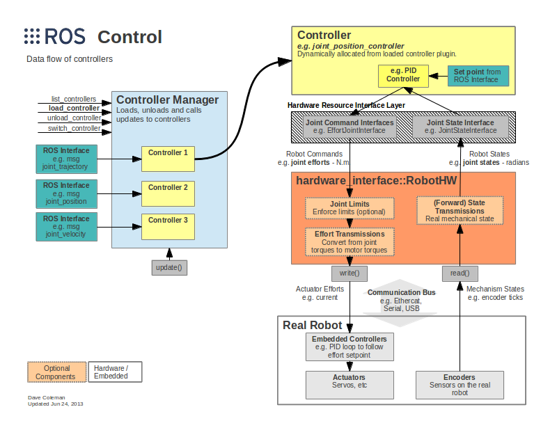
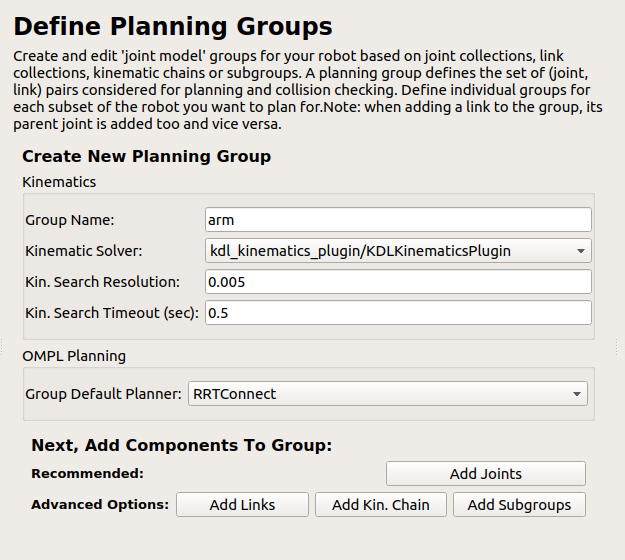
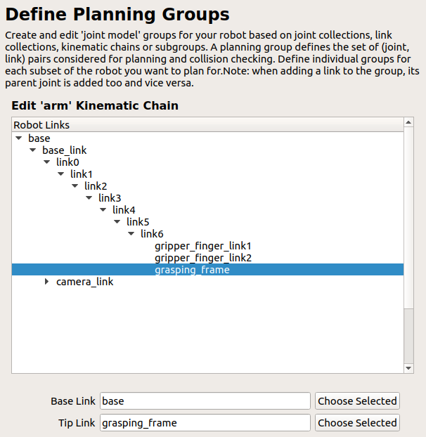
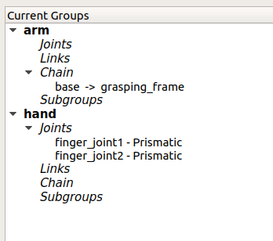
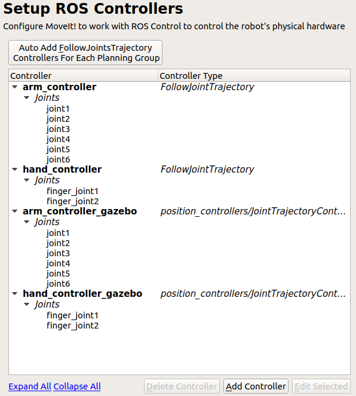
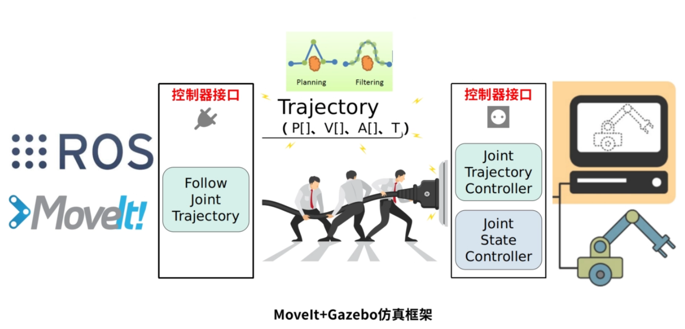

# ROS Learning

## ROS简介

 ROS系统是起源于2007年斯坦福大学人工智能实验室的项目与机器人技术公司Willow Garage的个人机器人项目（Personal Robots Program）之间的合作，2008年之后就由Willow Garage来进行推动。

 ROS的首要设计目标是在机器人研发领域提高代码复用率。ROS是一种分布式处理框架（又名Nodes）。

**（1）点对点设计**

 **（2）多语言支持**

（3）精简与集成

（4）工具包丰富

（5）免费且开源

### ROS框架

一种是核心（main），一种是库（universe）

节点、消息、主题、服务

包、堆

rviz、tf、gazebo

rviz具备很强的扩展性，可以用来制作成机器人控制的上位机

移动机器人的案例：

turtlebot：

ROS探索总结：四到八;三十；

https://www.guyuehome.com/237

https://www.guyuehome.com/243

https://www.guyuehome.com/248

胡春旭研究生时的作品：

https://www.guyuehome.com/1856

机械臂：

https://www.guyuehome.com/455


>  最后，来发表一些对ROS的看法。ROS虽然好用，但是目前的ROS1还只适合于研发，如果没有强大的研发能力，建议还是不要轻易应用于产品。我们在开发过程中，遇到过以下一些坑：
>
> 1. roscore会突然挂掉，node会突然挂掉，rviz会突然挂掉，ROS的一切都会挂，系统就go die。。。 
>
> 2. moveit没办法实现连续运动，也没有点动等基本操作，需要去看moveit的底层代码然后重新组合去实现。 
>
> 3. ROS没有实时功能，需要自己搭建实时核，开发实时任务 
>
> 4. ROS资源占用率较大，对计算机的性能要求较高 


ROS的一些缺陷：

缺乏构建多机器人系统的标准方法；

在Windows、MacOS、RTOS等系统上无法应用或者功能有限；

缺少实时性方面的设计；

需要良好的网络环境保证数据的完整性，而且网络没有数据加密、安全防护等功能；

ROS 1的稳定性欠佳，研究开发与上市产品之间的过渡艰难；


## urdf 模型导入


## moveit官方学习

### moveit setup 配置助手

### 底层控制器（Low Level Controllers）

> We will assume that your robot offers a `FollowJointTrajectory` action service for the arms on your robot and (optionally) a `GripperCommand` service for your gripper.

* YAML Configuration

文件名形如：`controllers.yaml`

* Create the Controller launch file

新建 controller launch file（`robot_moveit_controller_manager.launch.xml`）

内容如下

```xml
<launch>
 <!-- Set the param that trajectory_execution_manager needs to find the controller plugin -->
 <arg name="moveit_controller_manager" default="moveit_simple_controller_manager/MoveItSimpleControllerManager" />
 <param name="moveit_controller_manager" value="$(arg moveit_controller_manager)"/>
 <!-- load controller_list -->
 <rosparam file="$(find robot_moveit_config)/config/controllers.yaml"/>
</launch>
```

* Debugging Information

使用`rostopic list`或者`rostopic info topic_name`，如果看到下列的话题说明正确

> - /panda_arm_controller/follow_joint_trajectory/goal
> - /panda_arm_controller/follow_joint_trajectory/feedback
> - /panda_arm_controller/follow_joint_trajectory/result
> - /hand_controller/gripper_action/goal
> - /hand_controller/gripper_action/feedback
> - /hand_controller/gripper_action/result

* Remapping /joint_states topic

如果你在运行`move group node`，你可能需要重新映射（remap）`/joint_states` 到`/robot/joint_states`，否则Moveit无法获取关节的feedback，重新映射的方式如下

```xml
<node pkg="moveit_ros_move_group" type="move_group" name="any_name" output="screen">
  <remap from="joint_states" to="robot/joint_states"/>
</node>
```

或者你可以编写一个订阅正确话题名称的订阅者（subscriber），通过订阅者的反馈来保证你的运动规划组的机器人的初始状态对应正确的关节角。

* Trajectory Execution Manager Options

配置执行管道（execution pipeline）的表现和安全性，在`trajectory_execution.launch.xml`文件中定义

参数包括：

`execution_duration_monitoring`：如果为false，则不会抛出错误，因为轨迹花费的时间比预期在底层控制器侧完成的时间长

`allowed_goal_duration_margin`：在触发轨迹取消之前，允许超出预期的执行时间（在缩放后应用）

`allowed_start_tolerance`：允许关节值公差用于验证轨迹的第一点与当前机器人状态匹配。 如果设置为零，将跳过等待机器人在执行后停止的过程

### ros_control

> http://wiki.ros.org/ros_control



ros_control包输入为：来自机器人执行器编码器（encoders）的关节状态数据（joint state data）和输入设定点作为输入。 它使用通用的控制回路反馈机制（通常是PID控制器）来控制发送到执行器的输出（比如力矩、电流、电压）。 ros_control对于没有joint position，effort（关节位置、力）等一一对应关系的物理机制的情况时，会变得更加复杂，但是这些情况是使用转换（transmission）来解决的。

**控制器：controllers**

你可以自己创建自己的控制器，提供的控制器如下（所有都采用的前馈控制器）

* 力控制器，指定期望的关节力或力矩
  * joint_effort_controller 
  * joint_position_controller
  * joint_velocity_controller
* 关节状态控制器，将硬件接口`hardware_interface::[JointStateInterface] `所有注册的信息封装成`[sensor_msgs/JointState]`：joint_state_controller
* 位置控制器：设置多关节的位置，joint_position_controller，joint_group_position_controller 
* 速度控制器：设置多关节的速度，joint_velocity_controller ，joint_group_velocity_controller 
* 关节轨迹控制器： Extra functionality for splining an entire trajectory. 
  * position_controller 
  * velocity_controller 
  * effort_controller 
  * position_velocity_controller 
  * position_velocity_acceleration_controller 

**硬件接口：**

待阅读：

http://gazebosim.org/tutorials?tut=ros_control&cat=connect_ros

http://gazebosim.org/tutorials?cat=connect_ros

http://wiki.ros.org/gazebo_ros_pkgs

https://answers.ros.org/question/320990/moveit-unable-to-identify-any-set-of-controllers/

https://answers.ros.org/question/296694/follow_joint_trajectory-action-client-not-connected/

http://docs.ros.org/melodic/api/moveit_tutorials/html/doc/moveit_commander_scripting/moveit_commander_scripting_tutorial.html

https://zhuanlan.zhihu.com/p/63229276


### moveit编程

### 关节空间的规划：

#### 正运动学控制的方法

流程：先确定group 再确定约束 再确定目标位置 再规划，最后执行

初始化 move_group 的API

初始化ROS节点

初始化需要使用的 **move group** 控制的机械臂中的arm group

​	`arm = moveit_commander.MoveGroupCommander('manipulator')`

设置机械臂运动的允许误差值

设置允许的最大速度和加速度（设置一个系数，即最大速度的百分比 0-1的值）

设置机械臂的**目标位置**（有两种方法：一、named target  二、value target），**正运动学**

​	named target ： 别名的方法

​	value target ： 六轴的位置数据进行描述（单位：弧度）

> 问题：很难确定六关节的角度

控制机械臂运动 ： `arm.go()`: 相当于 plan and execute 先规划再执行

> 如果遇到无法求解的情况怎么办？

关闭并退出moveit

```shell
 # 目标catkin whitelist 白名单 packages 包
 catkin_make -DCATKIN_WHITELIST_PACKAGES="c800_description"
```

#### 逆运动学控制的方法	

通过四元数描述，基于base_link 坐标系，通过**逆向运动学**

流程：

初始化 move_group 的API

初始化ROS节点

初始化需要使用的 **move group** 控制的机械臂中的arm group

​	`arm = moveit_commander.MoveGroupCommander('manipulator')`

获取**终端**link名称

设置目标位置所使用的**参考坐标系**

 当运动规划失败后允许重新规划（KDL 数值求解方法）

设置位置、姿态的允许误差

设置允许的最大速度和加速度

**描述目标位姿**

​	位置：x y z

​	姿态：orientation（x，y，z，w）


### 笛卡尔空间的规划

会有一个路径列表：`waypoints`


## 实例一、相机二维码跟踪

> https://www.guyuehome.com/6873

### 机械臂模型

对于一般机械臂模型描述package，我们用robotname_description命名

对于模型可以通过**手动建模**或者通过**CAD软件**导入

package需要的依赖包括：`urdf,xacro`

`xacro`是`urdf`的改良型模型文件，可以进行宏定义、头文件包含、数学运算等操作

#### xacro 语法

> https://zhuanlan.zhihu.com/p/67741739 移动机器人xacro案例
>
> http://wiki.ros.org/xacro   ros官网关于xacro的介绍

这里涉及到xacro建模，在复现移动机器人案例的时候可能会出现如下**报错**

`UnicodeEncodeError: 'ascii' codec can't encode characters in position 1017-1021: ordinal not in range(128)`

这里出现报错的原因：python转码的原因，字符串在Python内部的表示是unicode编码，因此，在做编码转换时，通常需要以unicode作为中间编码，即先将其他编码的字符串解码（decode）成unicode，再从unicode编码（encode）成另一种编码。

也就是说字符串在python转码出现问题，解决方法是删除xacro文件的**出现的中文字符**

package中包含：

`config:配置文件（gazebo/rviz等）	launch：	meshes：模型表面贴纸	urdf：模型文件`

**检查urdf模型整体结构**（注：对于xacro编写的模型不适用）

`urdf_to_graphiz robot_description.urdf(urdf文件）#输出一个模型结构的urdf图`

若没有安装则先用`apt-get`安装

检查xacro模型

通过rviz launch文件

`xacro`**文件的格式**，文件后缀为`.xacro`

```xml
<?xml version="1.0" ?>
<robot name="robot_name" xmlns:xacro="http://www.ros.org/wiki/xacro">
    ...
</robot>  
```

**property and property block**

```xml
<xacro:property name="the_radius" value="2.1" />
<xacro:property name="the_length" value="4.5" />
<geometry type="cylinder" radius="${the_radius}" length="${the_length}" />
```

通过dollared-braces（${}）

```xml
<xacro:property name="front_left_origin">
  <origin xyz="0.3 0 0" rpy="0 0 0" />
</xacro:property>

<pr2_wheel name="front_left_wheel">
  <xacro:insert_block name="front_left_origin" />
</pr2_wheel>
```

**macros/宏指令**

The main feature of xacro is its support for macros.  Define macros with the macro tag, and specify the macro name and the list of parameters.   The list of parameters should be whitespace separated. They become  macro-local properties. 

xacro的主要特征是支持macros，通过`macro`标签定义宏指令，包括宏指令的名字和参数列表。参数之间需要用空格隔开，他们是宏指令局部属性。

1. 定义方法

   ```xml
   <xacro:macro name="pr2_caster" params="suffix *origin **content **anothercontent">
     <joint name="caster_${suffix}_joint">
       <axis xyz="0 0 1" />
     </joint>
     <link name="caster_${suffix}">
       <xacro:insert_block name="origin" />
       <xacro:insert_block name="content" />
       <xacro:insert_block name="anothercontent" />
     </link>
   </xacro:macro>
   ```

2. 调用方法

   ```xml
   <xacro:pr2_caster suffix="front_left">
     <pose xyz="0 1 0" rpy="0 0 0" />
     <container>
       <color name="yellow"/>
       <mass>0.1</mass>
     </container>
     <another>
       <inertial>
         <origin xyz="0 0 0.5" rpy="0 0 0"/>
         <mass value="1"/>
         <inertia ixx="100"  ixy="0"  ixz="0" iyy="100" iyz="0" izz="100" />
       </inertial>
     </another>
   </xacro:pr2_caster>
   ```

   

#### 机械臂代码部分

##### marm.xacro

文件1`marm.xacro`描述机械臂本体部分

```xml
<?xml version="1.0"?>
<robot name="mbot" xmlns:xacro="http://www.ros.org/wiki/xacro">
       
    <material name="Black">
        <color rgba="0 0 0 1"/>
    </material>
    <material name="White">
        <color rgba="1 1 1 0.95"/>
    </material>
    <material name="Blue">
        <color rgba="0 0 1 1"/>
    </material>
    <material name="Yellow">
        <color rgba="1 0.4 0 1"/>
    </material>
    <material name="Red">
        <color rgba="1 0 0 1"/>
    </material>


    <!-- link1 properties -->
    <xacro:property name="link0_radius" value="0.05" />
    <xacro:property name="link0_length" value="0.04" />
    <xacro:property name="link0_mass" value="1" />

    <!-- link1 properties -->
    <xacro:property name="link1_radius" value="0.03" />
    <xacro:property name="link1_length" value="0.10" />
    <xacro:property name="link1_mass" value="1" />

    <!-- link2 properties -->
    <xacro:property name="link2_radius" value="0.03" />
    <xacro:property name="link2_length" value="0.14" />
    <xacro:property name="link2_mass" value="0.8" />

    <!-- link3 properties -->
    <xacro:property name="link3_radius" value="0.03" />
    <xacro:property name="link3_length" value="0.15" />
    <xacro:property name="link3_mass" value="0.8" />

    <!-- link4 properties -->
    <xacro:property name="link4_radius" value="0.025" />
    <xacro:property name="link4_length" value="0.06" />
    <xacro:property name="link4_mass" value="0.7" />

    <!-- link5 properties -->
    <xacro:property name="link5_radius" value="0.03" />
    <xacro:property name="link5_length" value="0.06" />
    <xacro:property name="link5_mass" value="0.7" />

    <!-- link6 properties -->
    <xacro:property name="link6_radius" value="0.04" />
    <xacro:property name="link6_length" value="0.02" />
    <xacro:property name="link6_mass" value="0.6" />

    <!-- gripper -->
    <xacro:property name="gripper_length" value="0.03" />
    <xacro:property name="gripper_width" value="0.01" />
    <xacro:property name="gripper_height" value="0.06" />
    <xacro:property name="gripper_mass" value="0.5" />

    <xacro:property name="M_PI" value="3.1415926"/>


 <!-- Gripper frame -->
    <xacro:property name="grasp_frame_radius" value="0.001" />

    <!-- Macro for inertia matrix -->
    <xacro:macro name="cylinder_inertial_matrix" params="m r h">
        <inertial>
            <mass value="${m}" />
            <inertia ixx="${m*(3*r*r+h*h)/12}" ixy = "0" ixz = "0"
                iyy="${m*(3*r*r+h*h)/12}" iyz = "0"
                izz="${m*r*r/2}" /> 
        </inertial>
    </xacro:macro>

    <xacro:macro name="box_inertial_matrix" params="m w h d">
        <inertial>
            <mass value="${m}" />
            <inertia ixx="${m*(h*h+d*d)/12}" ixy = "0" ixz = "0"
                iyy="${m*(w*w+d*d)/12}" iyz = "0"
                izz="${m*(w*w+h*h)/12}" /> 
        </inertial>
    </xacro:macro>

    <!-- /////////////////////////////////////   ARM BASE    ////////////////////////////////////////////// -->

    <!--xacro:macro name="arm_base" -->
    <xacro:macro name="arm_base" params="parent xyz rpy">
        <joint name="${parent}_arm_joint" type="fixed">
            <origin xyz="${xyz}" rpy="${rpy}" />        
            <parent link="${parent}"/>
            <child link="base_link" />
        </joint>
    
        <link name="base_link">
            <visual>
                <origin xyz="0 0 0" rpy="0 0 0" />
                <geometry>
                    <box size="0.001 0.001 0.001" />
                </geometry>
            </visual>
        </link>

        <joint name="base_joint" type="fixed">
            <origin xyz="0 0 ${link0_length/2}" rpy="0 0 0" />        
            <parent link="base_link"/>
            <child link="link0" />
        </joint>

        <!-- /////////////////////////////////////    LINK0    ////////////////////////////////////////////// -->
        <link name="link0">
            <visual>
                <origin xyz="0 0 0" rpy="0 0 0" />
                <geometry>
                    <cylinder radius="${link0_radius}" length="${link0_length}"/>
                </geometry>
                <material name="White" />
            </visual>
            <collision>
                <origin xyz="0 0 0" rpy="0 0 0" />
                <geometry>
                    <cylinder radius="${link0_radius}" length="${link0_length}"/>
                </geometry>
            </collision>
            <cylinder_inertial_matrix m="${link0_mass}" r="${link0_radius}" h="${link0_length}"/>
        </link>

        <joint name="joint1" type="revolute">
            <parent link="link0"/>
            <child link="link1"/>
            <origin xyz="0 0 ${link0_length/2}" rpy="0 ${M_PI/2} 0" />
            <axis xyz="-1 0 0" />
            <limit effort="300" velocity="1" lower="${-M_PI}" upper="${M_PI}"/>
        </joint>

        <!-- /////////////////////////////////////   LINK1  ////////////////////////////////////////////// -->
        <link name="link1" >
            <visual>
                <origin xyz="-${link1_length/2} 0 0" rpy="0 ${M_PI/2} 0" />
                <geometry>
                    <cylinder radius="${link1_radius}" length="${link1_length}"/>
                </geometry>
                <material name="Blue" />
            </visual>
            <collision>
                <origin xyz="-${link1_length/2} 0 0" rpy="0 ${M_PI/2} 0" />
                <geometry>
                    <cylinder radius="${link1_radius}" length="${link1_length}"/>
                </geometry>
            </collision>
            <cylinder_inertial_matrix m="${link1_mass}" r="${link1_radius}" h="${link1_length}"/>
        </link>

        <joint name="joint2" type="revolute">
            <parent link="link1"/>
            <child link="link2"/>
            <origin xyz="-${link1_length} 0 0.0" rpy="-${M_PI/2} 0 ${M_PI/2}" />
            <axis xyz="1 0 0" />
            <limit effort="300" velocity="1" lower="${-M_PI}" upper="${M_PI}" />
        </joint>

        <!-- ///////////////////////////////////////   LINK2  ////////////////////////////////////////////// -->
        <link name="link2" >
            <visual>
                <origin xyz="0 0 ${link2_length/2}" rpy="0 0 0" />
                <geometry>
                    <cylinder radius="${link2_radius}" length="${link2_length}"/>
                </geometry>
                <material name="White" />
            </visual>

            <collision>
                <origin xyz="0 0 ${link2_length/2}" rpy="0 0 0" />
                <geometry>
                    <cylinder radius="${link2_radius}" length="${link2_length}"/>
                </geometry>
            </collision>
            <cylinder_inertial_matrix m="${link2_mass}" r="${link2_radius}" h="${link2_length}"/>
        </link>

        <joint name="joint3" type="revolute">
            <parent link="link2"/>
            <child link="link3"/>
            <origin xyz="0 0 ${link2_length}" rpy="0 ${M_PI} 0" />
            <axis xyz="-1 0 0" />
            <limit effort="300" velocity="1" lower="${-M_PI}" upper="${M_PI}" />
        </joint>

        <!-- /////////////////////////////////   LINK3  ///////////////////////////////////////////////////// -->
        <link name="link3" >
            <visual>
                <origin xyz="0 0 -${link3_length/2}" rpy="0 0 0" />
                <geometry>
                    <cylinder radius="${link3_radius}" length="${link3_length}"/>
                </geometry>
                <material name="Blue" />
            </visual>
            <collision>
                <origin xyz="0 0 -${link3_length/2}" rpy="0 0 0" />
                <geometry>
                    <cylinder radius="${link3_radius}" length="${link3_length}"/>
                </geometry>
            </collision>
            <cylinder_inertial_matrix m="${link3_mass}" r="${link3_radius}" h="${link3_length}"/>
        </link>

        <joint name="joint4" type="revolute">
            <parent link="link3"/>
            <child link="link4"/>
            <origin xyz="0.0 0.0 -${link3_length}" rpy="0 ${M_PI/2} ${M_PI}" />
            <axis xyz="1 0 0" />
            <limit effort="300" velocity="1" lower="${-M_PI}" upper="${M_PI}" />
        </joint>

        <!-- ///////////////////////////////////   LINK4  //////////////////////////////////////////////// -->
        <link name="link4" >
            <visual>
                <origin xyz="${link4_length/2} 0 0" rpy="0 ${M_PI/2} 0" />
                <geometry>
                    <cylinder radius="${link4_radius}" length="${link4_length}"/>
                </geometry>
                <material name="Black" />
            </visual>
            <collision>
                <origin xyz="${link4_length/2} 0 0" rpy="0 ${M_PI/2} 0" />
                <geometry>
                    <cylinder radius="${link4_radius}" length="${link4_length}"/>
                </geometry>
            </collision>
            <cylinder_inertial_matrix m="${link4_mass}" r="${link4_radius}" h="${link4_length}"/>
        </link>

        <joint name="joint5" type="revolute">
            <parent link="link4"/>
            <child link="link5"/>
            <origin xyz="${link4_length} 0.0 0.0" rpy="0 ${M_PI/2} 0" />
            <axis xyz="1 0 0" />
            <limit effort="300" velocity="1" lower="${-M_PI}" upper="${M_PI}" />
        </joint>

        <!-- //////////////////////////////////   LINK5  ///////////////////////////////////////////////// -->
        <link name="link5">
            <visual>
                <origin xyz="0 0 ${link4_length/2}" rpy="0 0 0" />
                <geometry>
                    <cylinder radius="${link5_radius}" length="${link5_length}"/>
                </geometry>
                <material name="White" />
            </visual>
            <collision>
                <origin xyz="0 0 ${link4_length/2} " rpy="0 0 0" />
                <geometry>
                    <cylinder radius="${link5_radius}" length="${link5_length}"/>
                </geometry>
            </collision>
            <cylinder_inertial_matrix m="${link5_mass}" r="${link5_radius}" h="${link5_length}"/>
        </link>

        <joint name="joint6" type="revolute">
            <parent link="link5"/>
            <child link="link6"/>
            <origin xyz="0 0 ${link4_length}" rpy="${1.5*M_PI} -${M_PI/2} 0" />
            <axis xyz="1 0 0" />
            <limit effort="300" velocity="1" lower="${-2*M_PI}" upper="${2*M_PI}" />
        </joint>

        <!-- ////////////////////////////////   LINK6  ///////////////////////////////////////////////// -->
        <link name="link6">
            <visual>
                <origin xyz="${link6_length/2} 0 0 " rpy="0 ${M_PI/2} 0" />
                <geometry>
                    <cylinder radius="${link6_radius}" length="${link6_length}"/>
                </geometry>
                <material name="Blue" />
            </visual>
            <collision>
                <origin xyz="${link6_length/2} 0 0" rpy="0 ${M_PI/2} 0" />
                <geometry>
                    <cylinder radius="${link6_radius}" length="${link6_length}"/>
                </geometry>
            </collision>
            <cylinder_inertial_matrix m="${link6_mass}" r="${link6_radius}" h="${link6_length}"/>
        </link>

        <joint name="finger_joint1" type="prismatic">
            <parent link="link6"/>
            <child link="gripper_finger_link1"/>
            <origin xyz="${link6_length} -0.03 0" rpy="0 0 0" />
            <axis xyz="0 1 0" />
            <limit effort="100" lower="0" upper="0.06" velocity="0.02"/>
        </joint>

        <!-- //////////////////////////////////////   gripper   ////////////////////////////////////////////// -->
        <!-- LEFT GRIPPER AFT LINK -->
        <link name="gripper_finger_link1">
            <visual>
                <origin xyz="${gripper_height/2} 0 0" rpy="0 ${M_PI/2} 0" />
                <geometry>
                    <box size="${gripper_length} ${gripper_width} ${gripper_height}" />
                </geometry>
                <material name="White" />
            </visual>
            <collision>
                <origin xyz="${gripper_height/2} 0 0" rpy="0 ${M_PI/2} 0" />
                <geometry>
                    <box size="${gripper_length} ${gripper_width} ${gripper_height}" />
                </geometry>
            </collision>
            <box_inertial_matrix m="${gripper_mass}" w="${gripper_width}" h="${gripper_height}" d="${gripper_length}"/>
        </link>

        <joint name="finger_joint2" type="fixed">
            <parent link="link6"/>
            <child link="gripper_finger_link2"/>
            <origin xyz="${link6_length} 0.03 0" rpy="0 0 0" />
        </joint>

        <!-- RIGHT GRIPPER AFT LINK -->
        <link name="gripper_finger_link2">
            <visual>
                <origin xyz="${gripper_height/2} 0 0" rpy="0 ${M_PI/2} 0" />
                <geometry>
                    <box size="${gripper_length} ${gripper_width} ${gripper_height}" />
                </geometry>
                <material name="White" />
            </visual>
            <collision>
                <origin xyz="${gripper_height/2} 0 0" rpy="0 ${M_PI/2} 0" />
                <geometry>
                    <box size="${gripper_length} ${gripper_width} ${gripper_height}" />
                </geometry>
            </collision>
            <box_inertial_matrix m="${gripper_mass}" w="${gripper_width}" h="${gripper_height}" d="${gripper_length}"/>
        </link>

        <!-- Grasping frame -->
        <link name="grasping_frame"/>

        <joint name="grasping_frame_joint" type="fixed">
            <parent link="link6"/>
            <child link="grasping_frame"/>
            <origin xyz="${gripper_height} 0 0" rpy="0 0 0"/>
        </joint>
    </xacro:macro>
</robot>
```

定义机械臂的相机部分


##### marm_with_kinect.xacro

文件2 `marm_with_kinect.xacro`添加基座、相机部分

```xml
<?xml version="1.0"?>
<robot name="arm" xmlns:xacro="http://www.ros.org/wiki/xacro">

    <xacro:include filename="$(find mbot_description)/urdf/marm.xacro" />
    
    <link name="base">
        <visual>
            <origin xyz="0 0 0.005" rpy="0 0 0"/>
            <geometry>
                <box size="0.2 0.2 0.01"/>
            </geometry>
            <material name="White"/>
        </visual>
        <inertia>
            <mass value="500" />
            <inertia ixx="1.0" ixy="0.0" ixz="0.0" iyy="0.5" iyz="0.0" izz="1.0" />
        </inertia>
    </link>

    <xacro:arm_base parent="base" xyz="0 0 0" rpy="0 0 0"/>
   
   <!--neck link-->

</robot>
```


### 机械臂moveit配置

通过moveit配置机械臂分为一下步骤

1. 选择模型
2. 自碰撞检测
3. 虚拟关节
4. 定义规划组
5. 自定义位姿
6. 定义终端夹爪
7. 设置控制器
8. 生成仿真模型
9. 设置传感器
10. 设置作者信息
11. 生成包

* 启动moveit配置助手

```shell
roslaunch moveit_setup_assistant setup_assistant.launch 
```

* 创建新的moveit配置包（create new moveit configuration package），选择一个模型urdf或者xacro文件，load

  load后可以看到模型显示

* 自碰撞检测，选择产生碰撞矩阵（generate collision matrix），完成

* 虚拟关节（virtual joint），当你的机械臂和外界需要产生位置偏移时用到，这里跳过

* 定义规划组（Define planning groups）

  add group，此处我们需要两个运动规划组（机械臂运动规划组以及夹爪运动规划组）

  

  对于机械臂group需要定义运动学求解链，对于夹爪只需选择joints



最后得到



* 定义机器人的预定义姿态（例如设置机械臂的初始位置以及夹爪的合闭张开状态）

* 定义末端执行器（Define end effectors）

* 定义passive joints（不需要动的关节，这里不用设置）

* ROS control （先点击auto add 按钮），再添加controller

  效果如下图所示，注意到这里有4个控制器，前两个是moveit的，后两个是你收到moveit的轨迹之后去完成具体插补和机器人控制的，比如和gazebo结合，后缀带gazebo

  
  
* Simulation 点击generate urdf
  
  此时会自动产生urdf的文件，其中定义了硬件仿真接口，需要把文档中的`EffortJointInterface`改为`PositionJointInterface`
  
* 对相机进行配置：选择相机采集到数据的类型（point cloud 点云；Depth Map 深度信息）

  需要定义话题的名称，后续用来获取数据的接口，例如`/camera/depth/points`（注意：这是在urdf模型中已经设置好的）

  ```xml
  <cameraName>camera</cameraName>
  <alwaysOn>true</alwaysOn>
  <updateRate>10</updateRate>
  <imageTopicName>rgb/image_raw</imageTopicName>
  <depthImageTopicName>depth/image_raw</depthImageTopicName>
  <pointCloudTopicName>depth/points</pointCloudTopicName>
  <cameraInfoTopicName>rgb/camera_info</cameraInfoTopicName>            
  ```

  其余参数为设置相机对外界采样的精度

* 然后就可以欢快的设置自己的名字和邮箱

* 最后产生自动配置的包

  先在自己的工作空间下新建一个文件夹,文件夹的命名规则为：`robotname_moveit_config`，在本例中可以为`marm_moveit_config`,选择该文件夹，点击`generate`按钮成功生成包，退出即可

配置完成后运行：

`roslaunch marm_moveit_config demo.launch`进入moveit规划界面，成功表示完成Moveit！配置。

此时相机没有任何数据，rviz不具备相机的仿真功能

### Moveit+Gazebo仿真配置

主要思路是搭建moveit!和ros_control的桥梁，步骤描述如下：

1. 先在moveit端配置关节和传感器接口yaml文件，将其加载到rviz端
2. 再在机器人端配置ros_control和接口yaml文件，将机器人加载到Gazebo
3. 最后同时启动加载ros_control的Gazebo和加载moveit的rviz

核心组件：

控制器管理器- ros control（更低层次的驱动） controller manager

控制架构分析：


右边：真实机器人硬件	左边：程序指令

程序指令通过moveit做规划，规划的结果是**轨迹**，轨迹通过follow joint trajectory，将轨迹封装成ros里面的**action**，action发送到机器人的controller，在controller内部进行插补（轨迹的点间隔较长，需要根据读写频率插补）

控制器接口包括（Joint Trajectory Controller以及 Joint State Controller）



`ros_controllers.yaml`文件修改

打开moveit配置助手自动产生的上述文件，配置JointTrajectoryController这个接口

在文件中有如下的语段

```yaml
# Publish all joint states
# Creates the /joint_states topic necessary in ROS
joint_state_controller:
  type: joint_state_controller/JointStateController
  publish_rate: 50 #以50Hz的频率反馈机器人当前的姿态
controller_list:
  - name: arm_controller #这是FollowJointTrajectory类型的控制器，namespace为“arm_controller”
    action_ns: follow_joint_trajectory
    default: True
    type: FollowJointTrajectory
    joints:
      - joint1
      - joint2
      - joint3
      - joint4
      - joint5
      - joint6
  - name: hand_controller
    action_ns: follow_joint_trajectory
    default: True
    type: FollowJointTrajectory
    joints:
      - finger_joint1
      - finger_joint2
arm_controller: #为了使接口吻合，这里需要讲名字改为上述namespace的命名，在moveit配置过程中是不允许重名
  type: position_controllers/JointTrajectoryController
  joints:
    - joint1
    - joint2
    - joint3
    - joint4
    - joint5
    - joint6
    #....
```

接下需要配置`controller manager`,该配置在`launch`文件中的`ros_controllers.launch`完成

文件的内容如下：

```xml
<?xml version="1.0"?>
<launch>

  <!-- Load joint controller configurations from YAML file to parameter server -->
  <rosparam file="$(find marm_moveit_config)/config/ros_controllers.yaml" command="load"/>

  <!-- Load the controllers -->
  <node name="controller_spawner" pkg="controller_manager" type="spawner" respawn="false"
    output="screen" args="arm_controller hand_controller joint_state_controller"/>
  <!-- 这里需要将上述的arm_controller_gazebo hand_controller_gazebo改为arm_controller hand_controller，增加joint_state_controller ->
</launch>
```

完成上述两个修改即完成了仿真步骤

在运行过程中发现还需要将下列的代码块

```xml
  <!-- Run Rviz and load the default config to see the state of the move_group node -->
  <include file="$(find marm_moveit_config)/launch/moveit_rviz.launch">
    <arg name="config" value="true"/>
    <arg name="debug" value="$(arg debug)"/>
  </include>
```

改成这样的形式（config改成rviz_config）名字不同造成的

```xml
  <!-- Run Rviz and load the default config to see the state of the move_group node -->
  <include file="$(find marm_moveit_config)/launch/moveit_rviz.launch">
    <arg name="rviz_config" value="$(find marm_moveit_config)/launch/moveit.rviz"/>
    <arg name="debug" value="$(arg debug)"/>
  </include>
```

运行`roslaunch marm_moveit_config demo_gazebo.launch `

这里不能够完成连同仿真，不知道什么原因

**现象是：rviz的机械臂可以动，但是Gazebo中的机械臂不能动**

报错如下：

```shell
[ERROR] [1590325225.185861835, 37.029000000]: Unable to identify any set of controllers that can actuate the specified joints: [ joint_1 joint_2 joint_3 joint_4 joint_5 joint_6 ]
[ERROR] [1590325225.186244300, 37.029000000]: Known controllers and their joints:
[ERROR] [1590325225.186352089, 37.029000000]: Apparently trajectory initialization failed
```

明天来debug一下：

这种问题可能的原因在于：

1.修改 moveit_controller_manager.launch.xml文件


首先分析`demo_gazebo.launch`文件，该文件完成的内容为

1. 在gazebo中spawn出机器人，相关文件`gazebo.launch`
2. 加载配置文件到param server，相关文件是`planning_context.launch`
3. 启动`joint_state_publisher`节点和`robot_state_publisher`节点
4. 启动moveit!，相关文件`move_group.launch`
5. 启动Rviz并加载config，相关文件`moveit_rviz.launch`
6. 最后还有个数据库加载，此处略过


分析`gazebo.launch`文件，该文件完成的内容为

1. 加载一个空的世界，`empty_world.launch`
2. 画出机器人的模型
3. include了`ros_controllers.launch`,这应该是要建立gazebo和controller的联系


分析`ros_controllers.launch`文件，文件完成的内容

1. 加载`ros_controllers.yaml`文件
2. 启动`controller_manager`节点，加载了`arm_controller hand_controller joint_state_controller `控制器，即gazebo需要的两个接口


分析`planning_context.launch`感觉就是加载一些规划的参数，如`joint_limits.yaml`和`kinematics.yaml`


分析`move_group.launch`文件，加载规划组、传感器、轨迹执行，启动`moveit_gruop`节点


分析`moveit_rviz.launch`文件


报错

```shell
Action client not connected: arm_controller/follow_joint_trajectory
```

```shell
[ERROR] [1590371759.895057681, 0.445000000]: Could not load controller 'arm_controller' because controller type 'position_controllers/JointTrajectoryController' does not exist.
[ERROR] [1590371759.895122294, 0.445000000]: Use 'rosservice call controller_manager/list_controller_types' to get the available types
[ERROR] [1590371760.898430, 1.358000]: Failed to load arm_controller
```

我觉得原因在于没有action的话题


https://www.cnblogs.com/shawn0102/p/9021702.html

现在解决问题的思路：

1.按照报错的信息进行查询

2.按照一些官方给定的机器人进行操作

3.按照moveit官方教程进行操作


### 二维码识别包

```shell
sudo apt-get install ros-melodic-ar-track-alvar
```


安排：

b站

ROS入门21讲

solidworks urdf

C++

第一步：

SimMechanics Link 导入CAD模型和数据

看一下有没有现有的

`Quardrotor_Controller_xPC_158_jwu`


ROS下一步的学习计划：

相机二维码跟踪：古月居首页

ros control：https://www.guyuehome.com/890

action指令学习：https://www.guyuehome.com/908

rviz plugin：用qt做一个插件来发布指令，做一个可视化的界面控制

https://www.guyuehome.com/945

matlab_ros、matlab可视化控制ros：

https://www.guyuehome.com/1047

有限状态机smach：三十八、三十九

感觉挺复杂的，一种状态变化可视化的东西

https://www.guyuehome.com/1069

**看到一个比较完整的机械臂教程**

https://www.guyuehome.com/1159

动态参数配置：

twist_mux 多路切换器：应对一种话题的冲突机制；可以帮助我们切换到希望接收的数据源上。

https://www.guyuehome.com/1534

Kongfu机械臂介绍：一个不错的ppt展示

https://www.guyuehome.com/1608

百度 apollo ros 是对ros通讯机制的改良

https://www.guyuehome.com/1641：这篇介绍ros通讯问题还是比较有帮助

moveit 运动学插件：运动学求解器介绍，教你如何换一个高效的求解器

https://www.guyuehome.com/1921

ROS和verp软件集合

https://www.guyuehome.com/1966

launch文件学习

https://www.guyuehome.com/2195

moveit一些高级的用法：

https://www.guyuehome.com/2933

ROS视觉教程

https://www.guyuehome.com/2988


**我觉得学习一下ROS2还是有必要的**

但是ROS2带来了改变，支持构建的系统包括Linux、windows、Mac、RTOS，甚至没有操作系统的裸机。


### dynamixel 舵机 ros使用指南

> http://emanual.robotis.com/docs/en/software/dynamixel/dynamixel_workbench/
> http://emanual.robotis.com/docs/en/dxl/x/xh430-w350/#control-table-of-eeprom-area
> http://emanual.robotis.com/docs/en/dxl/protocol2/#status-packet

首先从官网下载

将文件`dynamixel-workbench,dynamixel-workbench-msgs,DynamixelsSDK`文件夹放进工作空间`catkin_ws`内，其中前面两个是main packages，SDK是depend package。

#### 如何编写一个简单的舵机控制程序

首先建立自己的功能包，添加的依赖：

```cmake
find_package(catkin REQUIRED COMPONENTS
  dynamixel_workbench_toolbox
  roscpp
  std_msgs
)
```

在`cpp`文件中是引入 `dynamixel_workbench_toolbox`这个API，这个API定义了官方提到的一些封装号的函数

```c++
#include<dynamixel_workbench_toolbox/dynamixel_workbench.h>
#include<ros/ros.h>
```

基本使用的方法如下（更多函数的用法参照官网，或者源文件）

```c++
DynamixelWorkbench dxl_wb; 	//声明对象
dxl_wb.begin("/dev/ttyUSB0",BAUDRATE);	//打开串口
dxl_wb.setPositionControlMode(ID);	//设置位置控制模式
dxl_wb.torqueOn(ID);	//上电，只有断电的情况下才能设置控制模式
dxl_wb.itemRead(ID,"Present_Position",&present_position);	//读取当前的位置
dxl_wb.itemWrite(ID,"Goal_Position",goal_position);			//写入目标的位置
// 这里的position current velocity 都是以int32_t的形式存储
```

#### 如何自己复现一个workbench

官方提供的workbench能够实现**YAML文件配置舵机，轨迹订阅、发布、插值**等功能，采用上小节的方法只能实现单舵机控制，官方的代码更具有稳定性和便捷性，但由于官方代码中还包含一些集成好的控制模式（二轮差速等），直接在其进行二次开发代码可读性差，灵活性差，因此本小节介绍如何借助官方源码实现`my_workbench`

本小节的思路按照各个功能展开：

##### 舵机配置

舵机配置需要借助YAML文件，其文件的内容如下所示：

```yaml
# yaml文件是一种可读性高的配置文件，官方提供的库能够方便的将其数据内容存储为树的形式
# 舵机中可以配置的参数参照官方提供的control table，注意命名方式

zero:		#舵机的别名
  ID: 0		#舵机的ID
  Operating_Mode: 0		#控制模式
  Current_Limit: 50		#电流限制
  Torque_Enable: 1
```

使用YAML文件需要在包中添加yaml的依赖，如果没有需提前安装

CMakeList文件：

```cmake
# add yaml_cpp
find_package(PkgConfig REQUIRED)
pkg_check_modules(YAML_CPP REQUIRED yaml-cpp)
find_path(YAML_CPP_INCLUDE_DIR
  NAMES yaml_cpp.h
  PATHS ${YAML_CPP_INCLUDE_DIRS}
)
find_library(YAML_CPP_LIBRARY
  NAMES YAML_CPP
  PATHS ${YAML_CPP_LIBRARY_DIRS}
)
link_directories(${YAML_CPP_LIBRARY_DIRS})

if(NOT ${YAML_CPP_VERSION} VERSION_LESS "0.5")
add_definitions(-DHAVE_NEW_YAMLCPP)
endif(NOT ${YAML_CPP_VERSION} VERSION_LESS "0.5")


# 包含路径
include_directories(
  include
  ${catkin_INCLUDE_DIRS}
  ${YAML_CPP_INCLUDE_DIRS}
)

# 生成可执行文件时也需要增加依赖
target_link_libraries(name ${catkin_LIBRARIES}  ${YAML_CPP_LIBRARIES})
```

Cpp文件以及h文件

h文件

```c++
#include <yaml-cpp/yaml.h>
#include <dynamixel_workbench_toolbox/dynamixel_workbench.h>
```

cpp文件

流程：

```c++
std::string port_name = "/dev/ttyUSB0";
uint32_t baud_rate = 57600;

// 在启动时可以修改串口位置以及波特率
if (argc < 2)
{
    ROS_ERROR("Please set '-port_name' and  '-baud_rate' arguments for connected Dynamixels");
    return 0;
}
else
{
    port_name = argv[1];
    baud_rate = atoi(argv[2]);
}

//定义了自己的controller类，这个controller 包含上小节的DynamixelWorkbench对象
MyDynamixelController dynamixel_controller;	

//获取yaml配置文件文件名,在launch文件中定义
std::string yaml_file = node_handle.param<std::string>("dynamixel_info", "");

//下列具体参考官方提供的源代码，流程如下
//这些函数都是controller对象的功能函数，其实现都从官方源码copy过来

//打开串口
dynamixel_controller.initWorkbench(port_name, baud_rate);	
//读取配置文件内容，并存储
dynamixel_controller.getDynamixelsInfo(yaml_file);	
//加载配置文件，显示当前舵机在线的数量，名字，以及id号
dynamixel_controller.loadDynamixels();
//将yaml文件的参数写入舵机
dynamixel_controller.initDynamixels();
//初始化control table，获取舵机当前值和目标值
dynamixel_controller.initControlItems();
// addSyncWriteHandler addSyncReadHandler
dynamixel_controller.initSDKHandlers();

//舵机配置部分结束
ROS_INFO("Welcome my dynamixel workbench!");
```

##### 读写舵机参数，并发布

官方提供了舵机状态信息的message，位于`dynamixel_workbench_msgs`中

```C++
#include <dynamixel_workbench_msgs/DynamixelStateList.h>
```

状态函数保存在

```yaml
# DynamixelStateList.msg
DynamixelState[] dynamixel_state

# DynamixelState.msg
string name
uint8  id

int32  present_position
int32  present_velocity
int16  present_current
```

通过**定时器**定时读取舵机的信息（位置、速度、电流等）保存在DynamixelStateList类型的msg中，发布舵机的传感参数，定义舵机的控制周期

```c++
ros::Timer read_timer = node_handle.createTimer(ros::Duration(dynamixel_controller.getReadPeriod()),
                                  &MyDynamixelController::readCallback,&dynamixel_controller);

ros::Timer write_timer = node_handle.createTimer(ros::Duration(dynamixel_controller.getWritePeriod()),
                               &MyDynamixelController::writeCallback, &dynamixel_controller);

ros::Timer publish_timer = node_handle.createTimer(ros::Duration(dynamixel_controller.getPublishPeriod()), 
                              &MyDynamixelController::publishCallback, &dynamixel_controller);
```

下列一次说明各个callback函数的注意点

```c++
/*******	readCallback	*******/
//readCallBack 中可以定义需要哪些数据，如果你需要位置、速度、电流的话
#define SYNC_READ_HANDLER_FOR_PRESENT_POSITION_VELOCITY_CURRENT 0	//定义在头文件中
// 接着copy提供的源文件即可,如
result = dxl_wb_->getSyncReadData(SYNC_READ_HANDLER_FOR_PRESENT_POSITION_VELOCITY_CURRENT,
                                id_array,
                                id_cnt,
                                control_items_["Present_Current"]->address,
                                control_items_["Present_Current"]->data_length,
                                get_current,
                                &log);

/*******	writeCallback	*******/
//在writeCallBack中，需要根据控制模式在头文件中预定义
/*
#define SYNC_WRITE_HANDLER_FOR_GOAL_POSITION 0
#define SYNC_WRITE_HANDLER_FOR_GOAL_VELOCITY 1
#define SYNC_WRITE_HANDLER_FOR_GOAL_CURRENT  2
*/
result = dxl_wb_->syncWrite(SYNC_WRITE_HANDLER_FOR_GOAL_CURRENT, id_array, id_cnt, dynamixel_current, 1, &log);	//例如以电流控制模式


/*******	publishCallback	*******/
dynamixel_state_list_pub_.publish(dynamixel_state_list_);
```

通过`rosbag`指令可以方便记录

```shell
rosbag record /my_dxl_master/dynamixel_state	#记录dynamixel_state msg

#将记录的数据转变成txt文件便于处理
rostopic echo -b 2020-03-31-20-05-26.bag -p my_dxl_master/dynamixel_state > state.txt

# 也可以通过	play 命令，此时通过rqt_plot 可以观察到数据
rosbag play filename.bag -l #循环播放
```

##### 轨迹发布以及插值

官方提供的解决方案是controller发布轨迹msg被master接受，再根据控制频率进行最小急动度插值

轨迹的文件有yaml文件格式定义，通过launch文件指定。

定义operator类

```c++
// 头文件
#include <ros/ros.h>
#include <yaml-cpp/yaml.h>

#include <trajectory_msgs/JointTrajectory.h>
#include <trajectory_msgs/JointTrajectoryPoint.h>
```

trajectory_msgs

```yaml
#trajectory_msgs/JointTrajectory.msg
Header header
string[] joint_names
JointTrajectoryPoint[] points

#trajectory_msgs/JointTrajectoryPoint.msg
# Each trajectory point specifies either positions[, velocities[, accelerations]]
# or positions[, effort] for the trajectory to be executed.
# All specified values are in the same order as the joint names in JointTrajectory.msg
float64[] positions
float64[] velocities
float64[] accelerations
float64[] effort
duration time_from_start

#desired_trajectory.msg
uint8[] id
int32[] goal_position
```

operator完成的任务

（1）解析轨迹yaml文件并存储到JointTrajectory中（2）将JointTrajectory发布出去

在这里官方的提供的轨迹文件格式说实话我有些看不懂（可能和当时需求有关），于是自己定义了一个格式，可供参考

```yaml
joint:
  names: [zero,first,second]
trajectory:
  index: [wp1,wp2]
  wp1:
    pos: [0,0,0]
    vel: [0.0,0.0]
    
    time_from_start: 0.2
  wp2:
    pos: [3.14,3.14,3.14]
    vel: [0.0,0.0]	#也可以定义加速度，我没用到
    time_from_start: 0.8
```

由于自己定义了文件的格式因此需要自己写解析的函数，参考如下

```c++
bool MyOperator::getTrajectoryInfo(const std::string yaml_file,
                     trajectory_msgs::JointTrajectory *jnt_tra_msg)
{
    YAML::Node file;
    file = YAML::LoadFile(yaml_file.c_str());
    if (file == NULL)
        return false;
    //
    YAML::Node joint = file["joint"];
    uint16_t joint_size = joint["names"].size();

    for (uint16_t index = 0; index < joint_size; index++)
    {
        std::string joint_name = joint["names"][index].as<std::string>();
        jnt_tra_msg->joint_names.push_back(joint["names"][index].as<std::string>());
    }
    //
    YAML::Node trajectory = file["trajectory"];
    uint16_t trajectory_size = trajectory["index"].size();
    for (uint16_t index = 0;index<trajectory_size;index++)
    {
        trajectory_msgs::JointTrajectoryPoint jnt_tra_point;
        std::string index_ = trajectory["index"][index].as<std::string>();
        YAML::Node wp_num = trajectory[index_];
        if (joint_size != wp_num["pos"].size())
        {
            ROS_ERROR("Please check way point pos size. It must be equal to joint size");
            return 0;
        }
        for (uint16_t size=0;size<wp_num["pos"].size();size++)
        {
            jnt_tra_point.positions.push_back(wp_num["pos"][size].as<double>());
            ROS_INFO("NO.way point : %s, position : %f", index_.c_str(), wp_num["pos"][size].as<double>());
        }
        if (wp_num["vel"] != NULL)
        {
            // 速度的size也要和pos一样
            for (uint16_t size=0;size<wp_num["vel"].size();size++)
            {
                jnt_tra_point.velocities.push_back(wp_num["vel"][size].as<double>());
                ROS_INFO("NO.way point : %s, velocity : %f", index_.c_str(), wp_num["vel"][size].as<double>());
            }
        }
        if (wp_num["acc"] != NULL)
        {
            //加速度的size也要和pos一样
            for (uint16_t size=0;size<wp_num["acc"].size();size++)
            {
                jnt_tra_point.accelerations.push_back(wp_num["acc"][size].as<double>());
                ROS_INFO("NO.way point : %s, acceleration : %f", index_.c_str(), wp_num["acc"][size].as<double>());
            }
        }
        if (wp_num["time_from_start"] == NULL)
        {
            ROS_ERROR("Please check time_from_start. It must be set time_from_start each waypoint");
            return 0;
        }
        jnt_tra_point.time_from_start.fromSec(wp_num["time_from_start"].as<double>());

        ROS_INFO("time_from_start : %f", wp_num["time_from_start"].as<double>());

        jnt_tra_msg->points.push_back(jnt_tra_point);     
    }
    return true;
}
```

发布轨迹的msg

```c++
joint_trajectory_pub_.publish(*jnt_tra_msg_);
```

轨迹发布之后就由master先接收，再根据控制频率进行插值

定义了一个`trajectoryMsgCallback`函数，代码可直接copy官方源码

轨迹插值的结果如下图所示：


